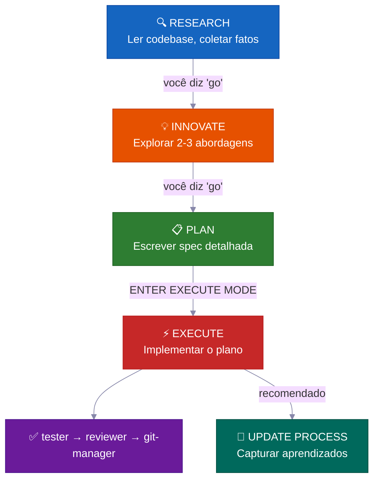
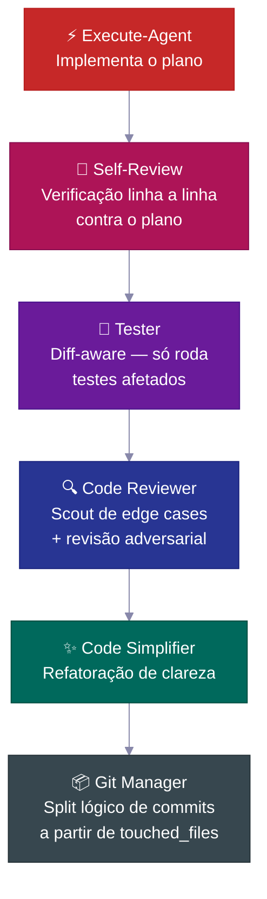
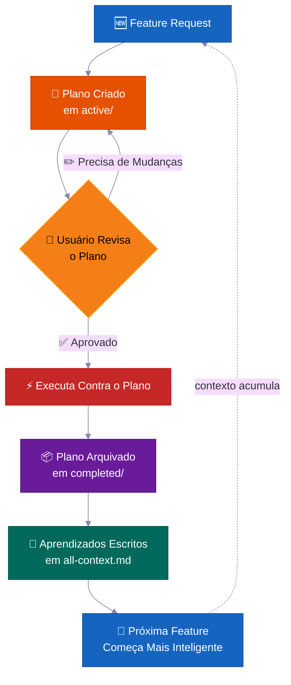
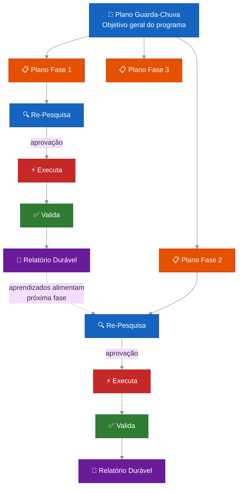

<p align="center">
  <a href="README.md">English</a> |
  <a href="README.zh-CN.md">简体中文</a> |
  <a href="README.ja-JP.md">日本語</a> |
  <a href="README.ko-KR.md">한국어</a> |
  <a href="README.vi-VN.md">Tiếng Việt</a> |
  <strong>Portugues</strong>
</p>

<div align="center">

<a href="https://flowser.ai">
  
</a>

*Patrocinado por [Flowser.ai](https://flowser.ai) — Agentes de IA com computadores para GTM*

<br>

# vibecode-pro-max-kit

**Seu agente de código AI começa a escrever código antes de entender seu projeto.<br>Esse harness transforma ele num engenheiro sênior que pesquisa, planeja e fica mais inteligente a cada feature.**

<br>

🔬 Desenvolvimento orientado a specs para agentes de IA<br>
📋 Gera PRDs automaticamente, gerencia backlogs, roteia contexto automaticamente<br>
🧠 Base de conhecimento que se auto-aprimora e acumula conforme você entrega<br>
⚡ Roda de forma autônoma por horas em tarefas grandes sem perder estado<br>
🤝 Planos e specs são compartilháveis — devs, PMs e stakeholders revisam os mesmos artefatos

<p align="center">
  
</p>

<p>
  <a href="https://github.com/withkynam/vibecode-pro-max-kit/stargazers"></a>
  <a href="https://github.com/withkynam/vibecode-pro-max-kit/network/members"></a>
  <a href="LICENSE"></a>
  <a href="https://github.com/withkynam/vibecode-pro-max-kit/graphs/contributors"></a>
  <a href="https://github.com/withkynam/vibecode-pro-max-kit/actions/workflows/validate.yml"></a>
  <a href="https://github.com/withkynam/vibecode-pro-max-kit/commits/main"></a>
  
  
  
</p>

</div>

---

## 🚀 Instalação (30 segundos)

```bash
curl -fsSL https://raw.githubusercontent.com/withkynam/vibecode-pro-max-kit/main/install.sh | bash
```

Depois abra o Claude Code e diga:

```
Run vc-setup
```

É isso. A skill de setup detecta sua stack, pergunta sobre seu projeto (uma conversa de verdade, não um checklist), cria a estrutura do diretório process, faz um scan profundo do seu codebase e popula os arquivos de contexto com conteúdo real — não placeholders.

<br>

<details>
<summary><strong>📦 O que é instalado</strong></summary>

<br>

```
your-project/
├── .claude/
│   ├── agents/              # 🤖 12 definições de agentes especializados
│   │   ├── vc-research-agent.md
│   │   ├── vc-execute-agent.md
│   │   └── ...
│   ├── skills/              # ⚡ 31 skills auto-descobertas
│   │   ├── vc-generate-plan/
│   │   ├── vc-security/
│   │   ├── vc-scout/
│   │   └── ...
│   └── hooks/               # 🪝 7 hooks de ciclo de vida
│       ├── privacy-block.cjs
│       ├── scout-block.cjs
│       └── ...
├── .codex/
│   └── agents/              # 🔄 Agentes espelhados para Codex
├── CLAUDE.md                # 📋 Orquestrador + regras de roteamento
├── AGENTS.md                # 📖 Registro de agentes
└── process/                 # 🧠 Criado pelo vc-setup (não pelo install)
    └── ...
```

- **Projeto novo?** Instala o harness completo, depois o `vc-setup` estuda seu codebase
- **Já tem `.claude/` configurado?** Faz backup em `.vibecode-backup/`, instala do zero, restaura seu `settings.json`
- **Já tem diretório `process/`?** Nunca é tocado pelo install — o `vc-setup` cuida da migração de forma inteligente
- **Já tem `CLAUDE.md`?** Faz backup como `CLAUDE.md.pre-vibecode`, instala a versão do harness

</details>

<details>
<summary><strong>🤖 Prompt completo de setup do agente</strong> (copie e cole no Claude Code para máximo controle)</summary>

```
First, install the vibecode-pro-max-kit agent harness by running this command:

curl -fsSL https://raw.githubusercontent.com/withkynam/vibecode-pro-max-kit/main/install.sh | bash

After the install completes, run vc-setup to configure everything for this project.

Follow the full interactive flow:

1. DETECT — Read package.json, detect my stack (framework, package manager, monorepo
   structure, test framework, database, auth). Also check if I have any existing .claude/,
   process/, or context files from a previous setup.

2. SHOW ME WHAT YOU FOUND — Present a summary of the detection results and wait for me
   to confirm before continuing. If this is an existing project with process/ folders or
   context files, tell me what you found and what looks good vs what could be improved.

3. ASK ME ABOUT THE PROJECT — Before scaffolding or scanning, have a real conversation
   with me about this project. Don't just ask a fixed list of questions and move on — ask
   follow-ups based on my answers, probe deeper on anything vague, and keep going until
   you genuinely understand the project. Start with the basics (what is this? who uses it?),
   then dig into architecture, features, conventions, pain points, and anything else that
   matters. Summarize your understanding back to me and confirm it's correct before moving on.

4. SCAFFOLD — Create the process/ directory structure. If I already have process/ folders,
   show me what you plan to change and wait for my approval before reorganizing anything.
   Never silently move or delete my existing files.

5. STUDY — Deep-scan the codebase and populate process/context/all-context.md with REAL
   content based on what you find AND what I told you. Include: repo structure, tech stack
   with versions, key patterns and conventions, import aliases, env vars, API routes,
   database schema, test setup. Do not leave placeholder text.

6. VALIDATE — Run all the validation checks to make sure everything is wired correctly.

Important rules:
- If I have existing context files or a well-written CLAUDE.md, read them first and
  preserve what is good. Merge intelligently — do not replace good content with generic scans.
- Show me a summary of what you plan to create or change at each major step and wait
  for my OK before proceeding.
- Do not create empty placeholder files. Only create files that have real content.
- Ask before reorganizing. If my existing setup works, tell me what you would improve
  and let me decide.
```

</details>

<br>

<details>
<summary>📖 Sumário</summary>

- [O Problema](#-o-problema)
- [A Solução](#️-a-solução)
- [Por Que Times Usam Isso](#-por-que-times-usam-isso)
- [O Que Torna Isso Diferente](#-o-que-torna-isso-diferente)
- [O Que Tem Dentro](#-o-que-tem-dentro)
- [Como Funciona](#-como-funciona)
- [Sistemas de Segurança Integrados](#️-sistemas-de-segurança-integrados)
- [Contribuindo](#contribuindo)
- [Star History](#-star-history)

</details>

---

## 🔥 O Problema

Você pede pro Claude "adicionar suporte a webhooks." Ele imediatamente começa a escrever código. Sem perguntas sobre sua arquitetura. Sem verificar padrões existentes. Sem plano. Você recebe 400 linhas que não encaixam no seu codebase, e gasta uma hora consertando.

**Mas isso é só a superfície.** Os problemas mais profundos doem mais:

<br>

> 🧠 **O contexto morre a cada sessão**
>
> Seu agente esquece tudo que aprendeu. Mesmos erros, mesmas perguntas, toda vez. Sem memória, sem conhecimento acumulado.

> 📄 **Docs ficam desatualizados instantaneamente**
>
> Você escreveu ótimos docs de contexto semana passada. Já estão desatualizados. Nada atualiza eles automaticamente conforme o codebase evolui.

> 💥 **Tarefas grandes colapsam no meio do caminho**
>
> A context window enche, o estado se perde, o agente começa a alucinar. Você recomeça do zero na hora 3.

> 🤝 **Sem specs, sem revisão, sem colaboração**
>
> Seu PM não consegue revisar o que o agente vai construir. Não existe artefato pra compartilhar, discutir ou aprovar antes do código ser escrito.

> 🎭 **Decisões de arquitetura são alucinadas**
>
> O agente inventa padrões em vez de pesquisar como outros codebases resolveram o mesmo problema.

<br>

**Seu agente tem inteligência mas não tem processo, memória, e nem como colaborar com seu time.**

---

## 🛠️ A Solução

Esse harness instala um sistema de desenvolvimento completo no seu projeto — não é só um arquivo CLAUDE.md, são **12 agentes especializados, 31 skills**, e um workflow com fases travadas que força seu agente a **entender antes de construir**.

<br>

| | O que resolve | Como |
|---|---|---|
| 📋 | **Planos orientados a specs** | PMs e devs revisam o mesmo artefato de plano antes de qualquer código ser escrito |
| 🔄 | **Contexto que se auto-atualiza** | Atualiza automaticamente toda vez que uma feature é entregue — docs nunca ficam defasados |
| ⚡ | **Execução autônoma** | Sobrevive à compactação de contexto — roda por horas, não minutos |
| 🧬 | **Pesquisa de arquitetura** | Estuda codebases reais antes de tomar decisões de design |
| 🧭 | **Roteamento inteligente de contexto** | Carrega só o que é relevante — não toda sua base de conhecimento toda vez |

<br>



Toda transição exige sua **aprovação explícita**. Nada avança automaticamente. Você mantém o controle.

---

## 💎 Por Que Times Usam Isso

> A maioria dos harnesses te dá um CLAUDE.md e instruções. Esse te dá um **sistema de desenvolvimento autônomo** que acumula inteligência ao longo do tempo.

<br>

### 📋 Desenvolvimento Orientado a Specs — Não a Vibes

Cada feature recebe um **plano escrito com análise de blast radius** antes de uma única linha de código ser escrita.

> 💡 Gera PRDs automaticamente, gerencia backlogs, organiza grupos de features. Funciona tanto pra devs quanto pra product managers — seu agente planeja como um engenheiro sênior, não como um estagiário.

**O que tem em cada plano:**

| Seção | Propósito |
|---|---|
| 📍 **Touchpoints** | Cada arquivo que será criado ou modificado, listado antecipadamente |
| 📜 **Contratos públicos** | Quais APIs ou interfaces mudam |
| 💥 **Blast radius** | O que pode quebrar, quais testes rodar, o que ficar de olho |
| ✅ **Evidência de verificação** | Como provar que a implementação está correta |
| 🔄 **Handoff de retomada** | Contexto suficiente pra qualquer agente retomar no meio do plano |

<br>

### 🔄 Execução Autônoma Multi-Fase — Horas de Trabalho Hands-Free

Para tarefas grandes, o agente roda um **loop iterativo por fases**:

```
🔍 pesquisa → ⚡ executa → ✅ valida → 📄 relatório → 🔄 repete
```

> 💡 Ele se auto-recupera quando trava, faz auto-reflexão pra melhorar a abordagem, e escreve relatórios de progresso duráveis em disco. **Compactação de contexto não mata ele** — todo estado vive em arquivos, não em memória.

Saia pra tomar um café e quando voltar, o trabalho já tá pronto.

<br>

### 🧬 Pesquisa de Arquitetura Automática — Aprenda com Qualquer Codebase

O agente não só lê seu código — ele **estuda outros repositórios** pra aprender como resolveram problemas similares (`vc-xia`).

> 💡 Ele pesquisa, compara abordagens e adapta os melhores padrões pro seu codebase. Decisões de arquitetura são informadas por implementações do mundo real, não por best practices alucinadas.

<br>

### 🧭 Roteamento Inteligente e Persistente de Contexto — Sempre o Contexto Certo

O contexto não é um arquivo gigante. Ele é organizado em **domínios de conhecimento auto-roteados**:

```
process/context/
├── all-context.md              # 🧭 Router raiz — lê sua tarefa, carrega o que é relevante
├── tests/
│   └── all-tests.md            # 🧪 Test runners, comandos, debugging
├── container/
│   └── all-container.md        # 🐳 Docker, deployment, infra
├── uxui/
│   └── all-uxui.md             # 🎨 Componentes, design tokens, padrões
└── {seu-dominio}/
    └── all-{dominio}.md        # 📚 Qualquer domínio com 3+ docs duráveis
```

> 💡 Quando o agente trabalha em billing, ele carrega contexto de billing — não os docs inteiros do seu codebase. O contexto **se auto-atualiza toda vez que você completa uma feature**, então nunca fica defasado.

<br>

### 🧠 Base de Conhecimento que Se Auto-Aprimora — Fica Mais Inteligente Conforme Você Entrega

Cada feature completada alimenta aprendizados de volta no sistema de contexto.

> 💡 Descobertas de pesquisa, decisões de arquitetura, insights de debugging e padrões de código são **capturados e indexados automaticamente**. Sua feature número 100 se beneficia de tudo que foi aprendido nas 99 anteriores. O conhecimento acumula — não reseta.

---

## ⚡ O Que Torna Isso Diferente

A maioria dos harnesses de agente te dá um CLAUDE.md grande e algumas instruções. Veja o que esse aqui realmente faz:

<br>

### 🔒 Restrições de Ferramentas Travadas por Fase

Seu agente literalmente **não consegue** escrever código durante a pesquisa.

> Cada fase tem restrições de ferramentas aplicadas no nível do agente — RESEARCH é somente leitura, INNOVATE não tem acesso ao Bash de jeito nenhum, PLAN só pode escrever em diretórios `process/`. Não são instruções que podem ser ignoradas — é **remoção real de capacidade**.

<br>

### 🎯 Auto-Roteamento Inteligente com Detecção de Intenção

O sistema detecta sua intenção a partir de linguagem natural e roteia pro pipeline correto automaticamente.

| Você diz | Sistema detecta | Roteia para |
|---|---|---|
| "build webhook support" | Feature request | 🔍 research → 💡 innovate → 📋 plan → ⚡ execute |
| "login is broken" | Bug | 🐛 debugger → ⚡ execute |
| "clean up the auth module" | Refactor | ✨ code-simplifier (ou pipeline completo se for comportamental) |
| "add rate limiting" | Feature (fast) | ⏩ fast-mode (pipeline comprimido) |

> 💡 Uma ordem de precedência de 6 níveis resolve conflitos quando múltiplas intenções batem. No máximo uma pergunta de esclarecimento — nunca um interrogatório de 20 perguntas.

<br>

### 🔍 Descoberta Automática de Skills (Step 0)

Antes de rotear qualquer request, o orquestrador escaneia **31 skills** e faz match por keywords.

> Diga "add webhook support" e ele automaticamente traz `vc-security` e `vc-scenario` junto com o workflow de feature. Você não precisa saber quais skills existem — **elas te encontram**.

<br>

### 💾 Sobrevive à Compactação da Context Window

Quando sua context window enche, **nada é perdido**.

```
Plans          →  process/general-plans/active/
Reports        →  process/features/{feature}/reports/
Context docs   →  process/context/{domain}/all-{domain}.md
Learnings      →  process/context/all-context.md
Approval state →  re-injected by session-init hook after compaction
```

> 💡 O hook session-init detecta eventos de compactação e re-injeta o estado do approval gate — assim o agente não pode silenciosamente pular uma aprovação que já recebeu.

<br>

### 🛡️ Auto-Policiamento com Detecção de Violação

Todo agente tem um protocolo de interrupção embutido.

> Quando ele detecta que está prestes a cruzar uma fronteira de fase, ele para sozinho: *"PHASE JUMPING PREVENTED: [atividade] pertence ao EXECUTE mas estou no modo RESEARCH."* Isso é uma **guard estrutural contra alucinação**.

<br>

### 🔄 Funciona no Claude Code e no Codex

Planos, contexto e skills são artefatos compartilhados.

```
.claude/agents/        ←→  .codex/agents/         # espelhados
.claude/skills/        ←→  .agents/skills          # symlink
process/               ←→  compartilhado           # planos, contexto, features
```

> 💡 Comece no Claude Code, continue no Codex. Mesmos agentes, mesmas skills, mesmo workflow.

---

## 🧭 Como Funciona

```
Seu request
  → Step 0: Descoberta de Skills (match de keywords → traz skills relevantes)
  → Detecção de Intenção (feature / bug / pergunta / refactor / UI)
  → Roteia pro agente certo
  → Execução travada por fase com transições explícitas
```

O orquestrador **nunca faz o trabalho ele mesmo** — ele roteia, monitora e gerencia transições.

<br>

### 📊 O Workflow

| Fase | O que acontece | Você diz |
|-------|-------------|---------|
| 🔍 **RESEARCH** | Coleta de fatos somente leitura — codebase + web | *(automático em feature requests)* |
| 💡 **INNOVATE** | Explora 2-3 abordagens com trade-offs | `go` |
| 📋 **PLAN** | Escreve uma spec detalhada que você pode revisar | `go` |
| ⚡ **EXECUTE** | Implementa exatamente o que foi planejado | `ENTER EXECUTE MODE` |
| 🧠 **UPDATE PROCESS** | Captura aprendizados, atualiza contexto, arquiva plano | *(recomendado após trabalho não-trivial)* |

> 💡 **Atalhos:** `ENTER FAST MODE - [tarefa]` comprime RESEARCH+INNOVATE+PLAN em uma passada — ainda pausa antes do EXECUTE. Correções triviais (arquivo único, <15 linhas, sem mudanças de schema/auth) vão direto pro execute.

<br>

### 💻 Sessão Típica

```
# 🆕 Feature request
Você: "add webhook support to the API"
→ Descoberta de skills traz: vc-scenario, vc-security
→ research-agent coleta contexto (somente leitura, não mexe no código)
→ Você diz "go" → innovate-agent explora abordagens
→ Você diz "go" → plan-agent escreve spec com blast radius
→ Você revisa o plano, diz "ENTER EXECUTE MODE"
→ execute-agent implementa → self-review → tester → code-reviewer → git-manager
→ Pacote de closeout: o que mudou, o que foi verificado, próximo passo recomendado
```

```
# 🐛 Bug fix
Você: "login redirect is broken"
→ Roteia pro vc-debugger → coleta de evidências → hipóteses concorrentes
→ Causa raiz identificada com cadeia de provas
→ execute-agent implementa a correção → pipeline de qualidade
```

```
# ⏩ Fast mode
Você: "ENTER FAST MODE - add rate limiting middleware"
→ Research+innovate+plan comprimidos em uma passada
→ Pausa de segurança obrigatória → você revisa → "ENTER EXECUTE MODE"
```

```
# 🏗️ Programa grande
Você: "build a full testing platform"
→ Cria plano guarda-chuva + planos por fase numa feature folder
→ Cada fase: re-pesquisa → aprova → executa → valida → relatório durável
→ Progresso sobrevive compactação de contexto — relatórios duráveis em disco
```

```
# 🔄 Otimização autônoma
Você: "improve test coverage to 80% using vc-autoresearch"
→ Agente itera: faz mudança → commit → mede → mantém/reverte
→ Detecção de travamento após 5 descartes consecutivos → muda de estratégia
→ Trilha de auditoria completa em TSV
```

---

## 🛡️ Sistemas de Segurança Integrados

Esses não são apenas guidelines — são **enforcement estrutural** embutido em cada agente.

<br>

> ⏸️ **Check-In de 50% no Meio da Implementação**
>
> Aproximadamente na metade da execução, o agente **pausa** pra reportar progresso, listar itens completados e restantes, e pergunta: *"Continuar com a abordagem atual ou pausar e voltar pro PLAN?"*

> 🚫 **Nunca Desvia Silenciosamente**
>
> Se o execute-agent encontra um problema que exige desvio do plano, ele **para imediatamente**, explica o problema e volta pro modo PLAN. Sem improviso silencioso.

> 🔙 **Protocolo de Abandono de Abordagem**
>
> Quando uma abordagem falha, o agente avalia componentes reutilizáveis, documenta lições antes de deletar, cria um resumo de abandono e volta pro PLAN. Conhecimento é preservado, não perdido.

> 🔐 **Hook de Guardrails de Privacidade**
>
> O agente é **bloqueado de ler** `.env`, credenciais, chaves SSH e arquivos `.pem`. Precisa pedir aprovação explícita. Design fail-open garante que um hook quebrado nunca bloqueia seu workflow.

> ⚠️ **Pacotes de Evidência para Alto Risco**
>
> Para mudanças que tocam auth, billing, migrações de schema ou APIs públicas — o sistema exige um pacote de evidência formal antes de considerar o trabalho "feito." Auto-stop se a evidência estiver faltando.

> 📊 **Scoring de Sinal de Drift**
>
> Após a execução, o sistema pontua a urgência de atualizações de processo: **LOW** (leve), **MEDIUM** (mudanças significativas), **HIGH** (arquivos de harness/protocolo tocados). Mudanças pequenas recebem um lembrete leve. Mudanças de protocolo recebem um push forte.

---

## 🔍 Inteligência Pré-Implementação

Antes de uma única linha de código ser escrita, o sistema consegue capturar problemas através de análises especializadas:

<br>

### 🎭 Debate Pré-Implementação com 5 Personas

**Skill:** `vc-predict`

| Persona | Foco |
|---|---|
| 🏗️ **Arquiteto** | Integridade estrutural, extensibilidade, tech debt |
| 🔐 **Segurança** | Superfícies de ataque, fluxos de auth, exposição de dados |
| ⚡ **Performance** | Latência, memória, gargalos de escalabilidade |
| 🎨 **UX** | Impacto no usuário, edge cases, acessibilidade |
| 😈 **Advogado do Diabo** | *"Por que não fazer nada?"* — questiona a premissa |

> 💡 Eles identificam concordâncias, resolvem conflitos através de ponderação de trade-offs e produzem um veredito **GO / CAUTION / STOP**.

<br>

### 🎲 Gerador de Edge Cases em 12 Dimensões

**Skill:** `vc-scenario`

> Decompõe qualquer feature em **12 dimensões** — gera 3-5 cenários por dimensão, ranqueados por severidade. Os outputs são diretamente utilizáveis como specs de teste.

| | | | |
|---|---|---|---|
| 👤 Tipos de Usuário | 📥 Extremos de Input | ⏱️ Timing | 📈 Escala |
| 🔄 Transições de Estado | 🌍 Ambiente | 💥 Cascatas de Erro | 🔑 Autorização |
| 💾 Integridade de Dados | 🔌 Integração | 📋 Compliance | 💰 Lógica de Negócio |

<br>

### 🔐 Auditoria de Segurança STRIDE + OWASP

**Skill:** `vc-security`

> Auditoria de segurança com dupla metodologia combinando **modelagem de ameaças STRIDE** com **OWASP Top 10**. Inclui auditoria de dependências, detecção de secrets e um **modo auto-fix** que ordena achados por severidade e corrige Critical primeiro — com guards de regressão em cada passo.

---

## 🤖 Capacidades de Agente Autônomo

<br>

### 🔄 Otimização Autônoma de Métricas

**Skill:** `vc-autoresearch`

Defina um objetivo, vá embora. O agente roda um **loop de otimização iterativo com backup em git** sobre qualquer métrica mensurável:

> 📈 Cobertura de testes · 📦 Bundle size · ⚠️ Erros de ESLint · 🚀 Score do Lighthouse

Cada iteração faz **UMA mudança atômica** → commit → mede → mantém ou reverte.

> 💡 Detecção de travamento dispara mudanças de estratégia após 5 descartes consecutivos. Trilha de auditoria completa em TSV.

<br>

### 👥 Times de Agentes em Paralelo

**Skill:** `vc-team`

Múltiplos agentes independentes trabalhando **simultaneamente** — não sequencialmente:

| Template | Como funciona |
|---|---|
| 🔍 **Research** | N ângulos explorados em paralelo |
| ⚡ **Execute** | Desenvolvedores em paralelo com **isolamento via git worktree** (zero conflitos de arquivo) |
| 🔎 **Review** | Revisores independentes produzindo achados deduplicados, ranqueados por severidade |
| 🐛 **Debug** | Hipóteses concorrentes testadas de forma adversarial — debuggers tentando refutar uns aos outros |

<br>

### 🔬 Debugging com Evidência Antes da Hipótese

**Agent:** `vc-debugger`

> O debugger coleta evidências primeiro → forma 2-3 hipóteses concorrentes → testa sistematicamente cada uma → documenta o caminho de eliminação → declara a causa raiz com uma cadeia de evidências.

Ele **nunca chuta — ele prova.** E não implementa correções — ele entrega um "fix boundary" de volta pro execute-agent.

---

## ✅ Pipeline de Qualidade — Integrado na Execução

O execute-agent não só escreve código e diz que terminou. Ele encadeia automaticamente um **pipeline de qualidade**:

<br>



<br>

| Passo | O que faz |
|---|---|
| 🔎 **Self-review** | Verifica cada item do checklist contra o plano buscando desvios, documenta eles |
| 🧪 **Tester** | Mapeia arquivos alterados para arquivos de teste, auto-escala pra suite completa quando >70% mapeado |
| 🔍 **Code reviewer** | Dispara scout de edge cases ANTES da revisão, verifica queries N+1, paths de auth, vazamentos de dados |
| ✨ **Simplifier** | Refatoração de clareza após revisão passar — sem mudanças de comportamento |
| 📦 **Git manager** | Recebe lista de `touched_files`, divide em commits convencionais lógicos, recusa arquivos desconhecidos |

---

## 📋 O Ciclo de Vida do Plano — Orientado a Specs, Não a Vibes

Toda feature não-trivial segue um **ciclo de vida de plano** — uma spec escrita que é criada, revisada, executada e arquivada como histórico do projeto.

<br>



<br>

> 💡 Daqui a seis meses, quando alguém perguntar *"por que construímos auth assim?"*, a resposta tá em `completed/`. Não perdida numa thread do Slack.

<br>

**Onde os planos ficam em disco:**

```
process/
├── general-plans/
│   ├── active/                  # 📋 Planos sendo trabalhados atualmente
│   │   └── webhooks_PLAN_28-05-26.md
│   ├── completed/               # ✅ Planos arquivados (histórico pesquisável)
│   ├── backlog/                 # 📌 Trabalho adiado
│   ├── reports/                 # 📄 Relatórios cross-cutting
│   └── references/              # 📚 Outputs de pesquisa
└── features/
    └── billing/                 # 🏷️ Escopo por feature (5+ artefatos)
        ├── active/
        ├── completed/
        ├── backlog/
        ├── reports/
        └── references/
```

---

## 🏗️ Programas de Fase — Projetos Grandes Que Não Desmoronam

Features normais usam um plano. **Projetos grandes multi-fase** usam um programa de fases — um plano guarda-chuva mais planos individuais por fase, cada um com seu próprio gate de validação.

<br>



<br>

**Funcionalidades principais:**

| | Funcionalidade | Por que importa |
|---|---|---|
| 🔄 | **Re-pesquisa a cada fase** | Verifica drift de código, lê relatórios mais recentes, atualiza premissas |
| ✅ | **Gates de validação** | Fase não é `VERIFIED` até evidência provar. Status honesto: `PLANNED` → `CODE DONE` → `TESTING` → `VERIFIED` ou `BLOCKED` |
| 📄 | **Relatórios duráveis** | Cada fase escreve resultados em disco. Progresso sobrevive compactação de contexto |
| 🧠 | **Aprendizados alimentam o futuro** | Descobertas da Fase 1 atualizam o plano da Fase 2 antes da execução |
| 🏗️ | **Fundação vs expansão** | Separa explicitamente "provar a arquitetura" de "implementar tudo" |
| 🚧 | **Tratamento honesto de blockers** | Fases bloqueadas ficam `BLOCKED` com evidência. Sem forçar status verde |

---

## 🧠 Context Groups — Conhecimento Organizado, Não Um Arquivo Gigante

O conhecimento do projeto é organizado em **context groups** — domínios de conhecimento duráveis, cada um com um router `all-{group}.md` que diz pros agentes o que ler e quando.

<br>

```
process/context/
├── all-context.md              # 🧭 Router raiz — arquitetura, stack, padrões, convenções
├── tests/
│   └── all-tests.md            # 🧪 Test runners, comandos, procedimentos de debugging
├── container/
│   └── all-container.md        # 🐳 Docker, deployment, procedimentos de infra
├── uxui/
│   └── all-uxui.md             # 🎨 Componentes, design tokens, padrões
├── infra/
│   └── all-infra.md            # 🖥️ Worker nodes, provisionamento, DNS
├── skills/
│   └── all-skills.md           # ⚡ Runtime de skills, arquitetura de apps
├── workflows/
│   └── all-workflows.md        # 🔄 Runtime de workflows, deployment
└── {seu-dominio}/
    └── all-{dominio}.md        # 📚 Qualquer domínio de conhecimento com 3+ docs duráveis
```

<br>

| | Como funciona |
|---|---|
| 🧭 **Padrão router** | Agentes leem só o que é relevante pra sua tarefa, não tudo |
| 📏 **Auto-promoção** | Tópicos com 3+ docs ou 800+ linhas ganham seu próprio context group |
| 🔄 **Docs vivos** | Atualizados pelo `update-process-agent` após cada feature não-trivial |
| 🧪 **Auditável** | `vc-audit-context` verifica roteamento e consistência |

---

## 📁 Feature Folders — Memória de Projeto Auto-Organizável

Quando um tópico acumula 5+ artefatos, ele ganha sua própria **feature folder** — um container de ciclo de vida completo.

<br>

```
process/features/{feature}/
├── active/       # 📋 Planos sendo trabalhados atualmente
├── completed/    # ✅ Planos arquivados (histórico de decisões pesquisável)
├── backlog/      # 📌 Trabalho adiado (agentes checam antes de duplicar)
├── reports/      # 📄 Relatórios de execução, post-mortems, resultados de validação
└── references/   # 📚 Outputs de pesquisa que informam decisões futuras
```

<br>

| | O que acontece |
|---|---|
| 🆕 | Trabalho novo começa em `active/` → relatórios acumulam → plano arquiva em `completed/` |
| 📌 | Trabalho adiado vai pro `backlog/` — agentes checam antes de criar planos duplicados |
| 📦 | Promoção de feature acontece automaticamente quando artefatos gerais chegam em 5+ |
| 🔍 | Cada feature tem histórico completo e auto-contido — planos, decisões, relatórios, pesquisa |

---

## 🤖 O Que Tem Dentro

<br>

### 12 Agentes

<details>
<summary>Clique pra expandir a lista de agentes (12 agentes)</summary>

<br>

**Agentes core do workflow** — um por fase RIPER-5:

| Agente | Papel |
|-------|------|
| 🔍 `vc-research-agent` | Pesquisa de codebase + web, somente leitura. Tracking de contradições embutido |
| 💡 `vc-innovate-agent` | Brainstorm de 2-3 abordagens. Deve produzir resumo de decisão antes do PLAN |
| 📋 `vc-plan-agent` | Escreve spec com guards anti-racionalização. "Eu já sei como" não é um plano |
| ⚡ `vc-execute-agent` | Implementa conforme plano. Check-in de 50%, protocolo de desvio, self-review |
| ⏩ `vc-fast-mode-agent` | RESEARCH→INNOVATE→PLAN comprimido com pausa de segurança obrigatória |
| 🧠 `vc-update-process-agent` | Checklist obrigatório de 7 fases incluindo scan de artefatos obsoletos |

<br>

**Agentes especialistas** — chamados durante EXECUTE ou standalone:

| Agente | Papel |
|-------|------|
| 🐛 `vc-debugger` | Evidência antes de hipótese. Hipóteses concorrentes, cadeias de eliminação |
| 🧪 `vc-tester` | Diff-aware. Só roda testes afetados. Auto-escala em mudanças de config |
| 🔎 `vc-code-reviewer` | Scout de edge cases ANTES da revisão. Detecção de N+1, validação de paths de auth |
| ✨ `vc-code-simplifier` | Refatoração de clareza sem mudança de comportamento |
| 🎨 `vc-ui-ux-designer` | Frontend design-aware. Pode spawnar subagent de pesquisa durante execução |
| 📦 `vc-git-manager` | Split lógico de commits a partir de `touched_files`. Recusa arquivos desconhecidos |

</details>

<br>

### 31 Skills (auto-descobertas)

<details>
<summary>Clique pra expandir a lista de skills (31 skills)</summary>

<br>

**🔧 Skills de contrato** — `vc-generate-plan` · `vc-generate-context` · `vc-audit-context` · `vc-audit-plans` · `vc-audit-vc` · `vc-setup` · `vc-update` · `vc-publish`

**🧠 Planejamento** — `vc-predict` (debate com 5 personas) · `vc-scenario` (edge cases em 12 dimensões) · `vc-sequential-thinking` · `vc-problem-solving`

**🐛 Debug & segurança** — `vc-debug` · `vc-security` (STRIDE + OWASP + auto-fix) · `vc-autoresearch` (otimização autônoma)

**📚 Pesquisa** — `vc-docs-seeker` · `vc-scout` · `vc-docs` · `vc-repomix` · `vc-xia` (comparação de repos)

**🎨 Frontend** — `vc-frontend-design` · `vc-chrome-devtools` · `vc-agent-browser` · `vc-web-testing`

**⚙️ Utilitários** — `vc-context-engineering` · `vc-mcp-management` · `vc-preview` · `vc-team` (agentes em paralelo) · `vc-tech-graph` · `vc-watzup` (handoff de sessão) · `vc-merge-worktree`

</details>

<br>

### 🪝 7 Hooks

| Hook | O que faz |
|------|-------------|
| 🔐 **Privacy guardrails** | Bloqueia `.env`, credenciais, chaves SSH. Requer aprovação explícita |
| 🚫 **Scout blocker** | Impede o agente de entrar em `node_modules/`, `dist/`. Sintaxe gitignore via `.ckignore` |
| 🧠 **Session init** | Detecta stack, injeta variáveis de ambiente, recupera approval gates após compactação |
| 💉 **Subagent context** | Injeta bloco de contexto compacto de ~200 tokens em cada subagent |
| ✨ **Edit quality** | Após 5+ edições, sugere rodar code-simplifier (não-bloqueante, com throttle) |
| 📛 **Descriptive naming** | Convenções de nomenclatura de arquivos language-aware em cada Write |
| 📊 **Usage tracking** | Métricas de sessão e awareness de tokens |

<br>

**Onde tudo fica:**

```
your-project/
├── .claude/
│   ├── agents/              # 🤖 12 definições de agentes (.md)
│   ├── skills/              # ⚡ 31 módulos de skills (cada um é um diretório com SKILL.md)
│   └── hooks/               # 🪝 7 hooks de ciclo de vida (.cjs)
├── .codex/
│   └── agents/              # 🔄 Espelhados para compatibilidade com Codex
├── .agents/
│   └── skills -> ../.claude/skills   # 🔗 Symlink pra descoberta pelo Codex
├── CLAUDE.md                # 📋 Config do orquestrador + regras de roteamento
├── AGENTS.md                # 📖 Registro de agentes + skills
└── process/
    ├── context/             # 🧠 Domínios de conhecimento auto-roteados
    ├── general-plans/       # 📋 Planos cross-cutting + relatórios
    ├── features/            # 🏷️ Folders de ciclo de vida por feature
    └── development-protocols/  # 📜 Regras de workflow compartilhadas
```

---

## 🔄 Atualizando

Puxe as melhorias mais recentes do harness:

```
Run vc-update
```

> 💡 Mostra um diff em dry-run, espera confirmação. Seu diretório `process/` e conteúdo específico do projeto **nunca são tocados**.

---

## Contribuindo

Contribuições são bem-vindas! Veja [CONTRIBUTING.pt-BR.md](CONTRIBUTING.pt-BR.md) para as diretrizes.

<br>

**Links rápidos:**

- 🐛 [Reportar um bug](https://github.com/withkynam/vibecode-pro-max-kit/issues/new?template=1.bug_report.yml)
- 💡 [Solicitar uma feature](https://github.com/withkynam/vibecode-pro-max-kit/issues/new?template=2.feature_request.yml)
- ⚡ [Enviar uma skill](https://github.com/withkynam/vibecode-pro-max-kit/issues/new?template=3.skill_submission.yml)
- 🌐 [Adicionar uma tradução](https://github.com/withkynam/vibecode-pro-max-kit/issues/new?template=5.translation.yml)

<br>

<a href="https://github.com/withkynam/vibecode-pro-max-kit/graphs/contributors">
  
</a>

---

## ⭐ Star History

<a href="https://star-history.com/#withkynam/vibecode-pro-max-kit&Date">
 <picture>
   <source media="(prefers-color-scheme: dark)" srcset="https://api.star-history.com/svg?repos=withkynam/vibecode-pro-max-kit&type=Date&theme=dark" />
   <source media="(prefers-color-scheme: light)" srcset="https://api.star-history.com/svg?repos=withkynam/vibecode-pro-max-kit&type=Date" />
   
 </picture>
</a>

---

## 📄 Licença

MIT