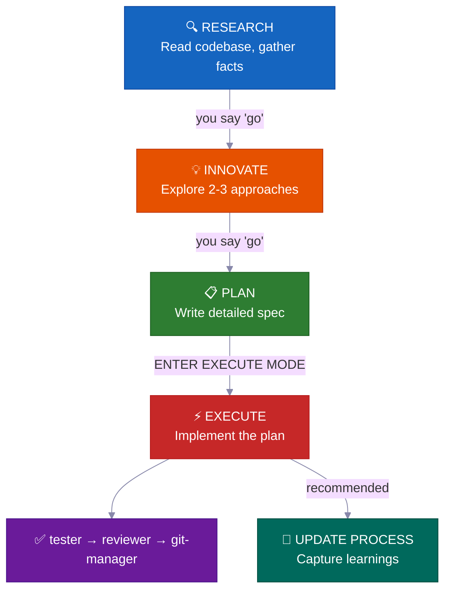
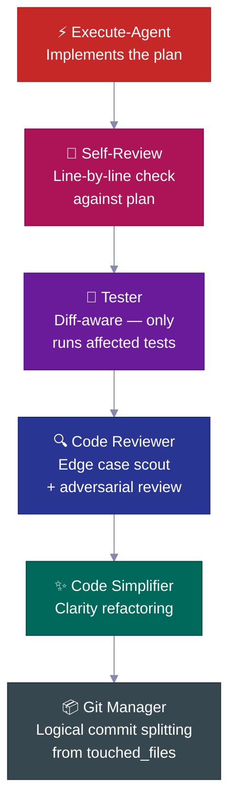
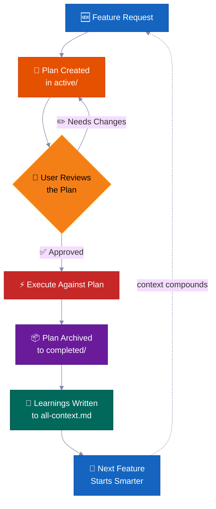
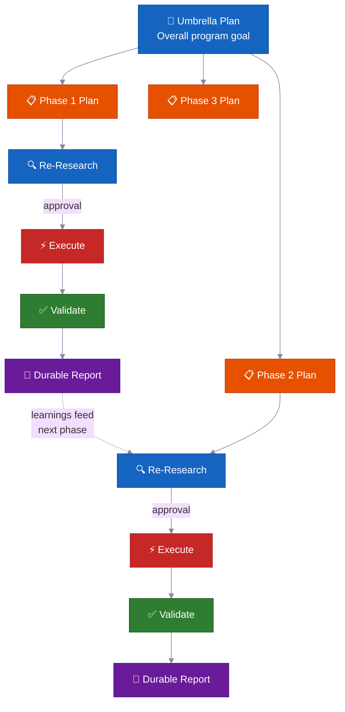

<p align="center">
  <a href="README.md">English</a> |
  <strong>简体中文</strong> |
  <a href="README.ja-JP.md">日本語</a> |
  <a href="README.ko-KR.md">한국어</a> |
  <a href="README.vi-VN.md">Tiếng Việt</a> |
  <a href="README.pt-BR.md">Portugues</a>
</p>

<div align="center">

<a href="https://flowser.ai">
  
</a>

*由 [Flowser.ai](https://flowser.ai) 赞助 — 带计算机能力的 AI Agents，专注 GTM*

<br>

# vibecode-pro-max-kit

**你的 AI 编程助手还没搞懂项目就开始写代码了。<br>这套 harness 把它变成一个会调研、会规划、越用越聪明的高级工程师。**

<br>

🔬 面向 AI agent 的 spec 驱动开发<br>
📋 自动生成 PRD、管理 backlog、自动路由上下文<br>
🧠 自我进化的知识库，随着你交付功能不断积累<br>
⚡ 大型任务可自主跑好几个小时都不丢状态<br>
🤝 计划和规范是可共享的——开发、PM、stakeholder 都看同一份产物

<p align="center">
  
</p>

<p>
  <a href="https://github.com/withkynam/vibecode-pro-max-kit/stargazers"></a>
  <a href="https://github.com/withkynam/vibecode-pro-max-kit/network/members"></a>
  <a href="LICENSE"></a>
  <a href="https://github.com/withkynam/vibecode-pro-max-kit/graphs/contributors"></a>
  <a href="https://github.com/withkynam/vibecode-pro-max-kit/actions/workflows/validate.yml"></a>
  <a href="https://github.com/withkynam/vibecode-pro-max-kit/commits/main"></a>
  
  
  
</p>

</div>

---

## 🚀 安装（30 秒搞定）

```bash
curl -fsSL https://raw.githubusercontent.com/withkynam/vibecode-pro-max-kit/main/install.sh | bash
```

然后打开 Claude Code 说：

```
Run vc-setup
```

搞定。setup skill 会检测你的技术栈，跟你聊聊项目（是真正的对话，不是走清单），搭建 process 目录，深度扫描代码库，用真实内容填充 context 文件——不是占位符。

<br>

<details>
<summary><strong>📦 安装了什么</strong></summary>

<br>

```
your-project/
├── .claude/
│   ├── agents/              # 🤖 12 个专用 agent 定义
│   │   ├── vc-research-agent.md
│   │   ├── vc-execute-agent.md
│   │   └── ...
│   ├── skills/              # ⚡ 31 个自动发现的 skills
│   │   ├── vc-generate-plan/
│   │   ├── vc-security/
│   │   ├── vc-scout/
│   │   └── ...
│   └── hooks/               # 🪝 7 个生命周期 hooks
│       ├── privacy-block.cjs
│       ├── scout-block.cjs
│       └── ...
├── .codex/
│   └── agents/              # 🔄 为 Codex 镜像的 agents
├── CLAUDE.md                # 📋 Orchestrator + 路由规则
├── AGENTS.md                # 📖 Agent 注册表
└── process/                 # 🧠 由 vc-setup 创建（不是 install）
    └── ...
```

- **新项目？** 安装完整 harness，然后 `vc-setup` 研究你的代码库
- **已有 `.claude/` 配置？** 备份到 `.vibecode-backup/`，全新安装，恢复你的 `settings.json`
- **已有 `process/` 目录？** install 完全不碰——`vc-setup` 会智能迁移
- **已有 `CLAUDE.md`？** 备份为 `CLAUDE.md.pre-vibecode`，安装 harness 版本

</details>

<details>
<summary><strong>🤖 完整的 agent setup 提示词</strong>（复制粘贴到 Claude Code 里可以获得最大控制力）</summary>

```
First, install the vibecode-pro-max-kit agent harness by running this command:

curl -fsSL https://raw.githubusercontent.com/withkynam/vibecode-pro-max-kit/main/install.sh | bash

After the install completes, run vc-setup to configure everything for this project.

Follow the full interactive flow:

1. DETECT — Read package.json, detect my stack (framework, package manager, monorepo
   structure, test framework, database, auth). Also check if I have any existing .claude/,
   process/, or context files from a previous setup.

2. SHOW ME WHAT YOU FOUND — Present a summary of the detection results and wait for me
   to confirm before continuing. If this is an existing project with process/ folders or
   context files, tell me what you found and what looks good vs what could be improved.

3. ASK ME ABOUT THE PROJECT — Before scaffolding or scanning, have a real conversation
   with me about this project. Don't just ask a fixed list of questions and move on — ask
   follow-ups based on my answers, probe deeper on anything vague, and keep going until
   you genuinely understand the project. Start with the basics (what is this? who uses it?),
   then dig into architecture, features, conventions, pain points, and anything else that
   matters. Summarize your understanding back to me and confirm it's correct before moving on.

4. SCAFFOLD — Create the process/ directory structure. If I already have process/ folders,
   show me what you plan to change and wait for my approval before reorganizing anything.
   Never silently move or delete my existing files.

5. STUDY — Deep-scan the codebase and populate process/context/all-context.md with REAL
   content based on what you find AND what I told you. Include: repo structure, tech stack
   with versions, key patterns and conventions, import aliases, env vars, API routes,
   database schema, test setup. Do not leave placeholder text.

6. VALIDATE — Run all the validation checks to make sure everything is wired correctly.

Important rules:
- If I have existing context files or a well-written CLAUDE.md, read them first and
  preserve what is good. Merge intelligently — do not replace good content with generic scans.
- Show me a summary of what you plan to create or change at each major step and wait
  for my OK before proceeding.
- Do not create empty placeholder files. Only create files that have real content.
- Ask before reorganizing. If my existing setup works, tell me what you would improve
  and let me decide.
```

</details>

<br>

<details>
<summary>📖 目录</summary>

- [问题在哪](#-问题在哪)
- [解决方案](#️-解决方案)
- [团队为什么用这个](#-团队为什么用这个)
- [差异化在哪里](#-差异化在哪里)
- [里面有什么](#-里面有什么)
- [工作流程](#-工作流程)
- [内置安全机制](#️-内置安全机制)
- [贡献](#贡献)
- [Star 历史](#-star-历史)

</details>

---

## 🔥 问题在哪

你让 Claude "加个 webhook 支持"。它立刻就开始写代码了。没问你架构长啥样，没查现有的 pattern，没有计划。结果写了 400 行跟你代码库格格不入的东西，你花一个小时擦屁股。

**但这只是表面。** 深层问题更扎心：

<br>

> 🧠 **每次会话上下文都丢了**
>
> agent 忘掉了之前学到的所有东西。同样的错误，同样的问题，每次都来一遍。没记忆，没积累。

> 📄 **文档瞬间就过时了**
>
> 上周写的很棒的 context 文档，已经跟不上代码了。没有什么机制会自动更新它们。

> 💥 **大任务做到一半就崩了**
>
> context window 满了，状态丢了，agent 开始瞎编。第三个小时你只能从头再来。

> 🤝 **没有 spec、没有审查、没法协作**
>
> PM 没法 review agent 要做什么。在写代码之前，没有任何可以分享、讨论或审批的产物。

> 🎭 **架构决策全靠编**
>
> agent 自己发明 pattern，而不是去调研别的代码库是怎么解决同样问题的。

<br>

**你的 agent 有智力但没流程，没记忆，也没法跟团队协作。**

---

## 🛠️ 解决方案

这套 harness 给你的项目装上一整套开发体系——不只是一个 CLAUDE.md 文件，而是 **12 个专用 agent、31 个 skills**，加上一个阶段锁定的工作流，强制你的 agent **先理解再动手**。

<br>

| | 解决什么问题 | 怎么解决 |
|---|---|---|
| 📋 | **Spec 驱动的计划** | PM 和开发在写代码前 review 同一份 plan |
| 🔄 | **自我进化的 context** | 每次交付功能自动更新——文档永远不过时 |
| ⚡ | **自主执行** | 扛得住 context compaction——跑几个小时不是几分钟 |
| 🧬 | **架构调研** | 做设计决策前先研究真实代码库 |
| 🧭 | **智能 context 路由** | 只加载相关内容——不是每次都把整个知识库塞进去 |

<br>



每次阶段切换都需要你**明确批准**。不会自动推进。控制权始终在你手上。

---

## 💎 团队为什么用这个

> 大多数 harness 给你一个 CLAUDE.md 加一堆说明。这个给你一套**自主开发系统**，随着时间推移越来越聪明。

<br>

### 📋 Spec 驱动的开发——不是凭感觉

每个功能在写第一行代码之前都有**带影响面分析的书面计划**。

> 💡 自动生成 PRD，管理 backlog，组织 feature 分组。开发和产品都能用——你的 agent 像高级工程师一样做规划，不像实习生。

**每份计划包含：**

| 章节 | 用途 |
|---|---|
| 📍 **Touchpoints** | 所有要创建或修改的文件，提前列出 |
| 📜 **Public contracts** | 哪些 API 接口或 interface 会变 |
| 💥 **Blast radius** | 什么可能挂掉，跑什么测试，注意什么 |
| ✅ **Verification evidence** | 怎么证明实现是正确的 |
| 🔄 **Resume handoff** | 足够的上下文让任何 agent 都能半路接手 |

<br>

### 🔄 自主多阶段执行——放手好几个小时

对于大型任务，agent 跑一个**迭代式阶段循环**：

```
🔍 research → ⚡ execute → ✅ validate → 📄 report → 🔄 repeat
```

> 💡 卡住了会自我修复，反思后调整策略，还会把持久化的进度报告写到磁盘。**context compaction 干不掉它**——所有状态都在文件里，不在内存里。

放心去摸鱼，回来就是完成的活儿。

<br>

### 🧬 自动架构调研——从任何代码库学习

agent 不只是读你的代码——它会**研究其他仓库**学习别人怎么解决类似问题（`vc-xia`）。

> 💡 它调研、对比方案、把最佳 pattern 适配到你的代码库。架构决策基于真实世界的实现，而不是编出来的最佳实践。

<br>

### 🧭 持久化智能 Context 路由——总是加载对的上下文

Context 不是一个巨大的文件。它被组织成**自动路由的知识域**：

```
process/context/
├── all-context.md              # 🧭 根路由——读取你的任务，加载相关内容
├── tests/
│   └── all-tests.md            # 🧪 测试运行器、命令、调试
├── container/
│   └── all-container.md        # 🐳 Docker、部署、基础设施
├── uxui/
│   └── all-uxui.md             # 🎨 组件、设计 token、模式
└── {your-domain}/
    └── all-{domain}.md         # 📚 任何有 3+ 持久文档的领域
```

> 💡 agent 处理计费功能时只加载计费 context——不是你整个代码库的文档。context 在**每次完成功能后自动更新**，所以永远不会过时。

<br>

### 🧠 自我进化的知识库——越交付越聪明

每个完成的功能都会把经验反馈回 context 系统。

> 💡 调研发现、架构决策、调试洞察、编码模式都被**自动捕获和索引**。你的第 100 个功能能享受前 99 个功能积累的所有经验。知识在复利增长——不是每次归零。

---

## ⚡ 差异化在哪里

大多数 agent harness 给你一个大的 CLAUDE.md 加一些说明。这个实际上做了什么：

<br>

### 🔒 阶段锁定的工具限制

你的 agent 在调研阶段**根本写不了代码**。

> 每个阶段在 agent 层面有工具限制——RESEARCH 是只读的，INNOVATE 完全没有 Bash 权限，PLAN 只能写到 `process/` 目录。不是那种可以无视的建议——**是直接把能力给你禁掉**。

<br>

### 🎯 智能自动路由 + 意图识别

系统从自然语言识别你的意图，自动路由到正确的流水线。

| 你说 | 系统识别为 | 路由到 |
|---|---|---|
| "build webhook support" | 功能请求 | 🔍 research → 💡 innovate → 📋 plan → ⚡ execute |
| "login is broken" | Bug | 🐛 debugger → ⚡ execute |
| "clean up the auth module" | 重构 | ✨ code-simplifier（如果涉及行为变更就走完整流水线） |
| "add rate limiting" | 功能（快速） | ⏩ fast-mode（压缩流水线） |

> 💡 6 级优先级排序解决多意图冲突。最多问一个确认问题——绝不搞二十连问。

<br>

### 🔍 自动 Skill 发现（Step 0）

在路由任何请求之前，orchestrator 扫描 **31 个 skills** 并匹配关键词。

> 你说 "add webhook support"，它自动在功能工作流之外同时浮现 `vc-security` 和 `vc-scenario`。你不需要知道有什么 skills——**它们会自己找上你**。

<br>

### 💾 扛得住 Context Window Compaction

context window 满了的时候，**什么都不会丢**。

```
Plans          →  process/general-plans/active/
Reports        →  process/features/{feature}/reports/
Context docs   →  process/context/{domain}/all-{domain}.md
Learnings      →  process/context/all-context.md
Approval state →  re-injected by session-init hook after compaction
```

> 💡 session-init hook 检测 compaction 事件并重新注入审批门状态——所以 agent 不能偷偷跳过已经获得的审批。

<br>

### 🛡️ 自我纠错的违规检测

每个 agent 都有内置的中断协议。

> 当它检测到自己即将越过阶段边界时，会自己停下来：*"PHASE JUMPING PREVENTED: [activity] belongs to EXECUTE but I'm in RESEARCH mode."* 这是一个**结构化的幻觉防护机制**。

<br>

### 🔄 跨 Claude Code 和 Codex 工作

计划、context 和 skills 是共享产物。

```
.claude/agents/        ←→  .codex/agents/         # mirrored
.claude/skills/        ←→  .agents/skills          # symlinked
process/               ←→  shared by both          # plans, context, features
```

> 💡 在 Claude Code 里开始，在 Codex 里继续。同样的 agents、同样的 skills、同样的工作流。

---

## 🧭 工作流程

```
Your request
  → Step 0: Skill Discovery (match keywords → surface relevant skills)
  → Intent Detection (feature / bug / question / refactor / UI)
  → Route to the right agent
  → Phase-locked execution with explicit transitions
```

orchestrator **自己从不干活**——它只负责路由、监控和管理阶段切换。

<br>

### 📊 工作流

| 阶段 | 做什么 | 你说 |
|-------|-------------|---------|
| 🔍 **RESEARCH** | 只读的信息收集——代码库 + 网络 | *(功能请求自动触发)* |
| 💡 **INNOVATE** | 探索 2-3 种方案及其 trade-off | `go` |
| 📋 **PLAN** | 写一份你可以 review 的详细 spec | `go` |
| ⚡ **EXECUTE** | 严格按计划实现 | `ENTER EXECUTE MODE` |
| 🧠 **UPDATE PROCESS** | 捕获经验，更新 context，归档计划 | *(非平凡工作后建议执行)* |

> 💡 **快捷方式：** `ENTER FAST MODE - [task]` 把 RESEARCH+INNOVATE+PLAN 压缩成一步——但在 EXECUTE 前还是会暂停。小修小补（单文件、<15 行、不涉及 schema/auth 变更）直接跳到 execute。

<br>

### 💻 典型会话

```
# 🆕 Feature request
You: "add webhook support to the API"
→ Skill discovery surfaces: vc-scenario, vc-security
→ research-agent gathers context (read-only, can't touch code)
→ You say "go" → innovate-agent explores approaches
→ You say "go" → plan-agent writes spec with blast radius
→ You review the plan, say "ENTER EXECUTE MODE"
→ execute-agent implements → self-review → tester → code-reviewer → git-manager
→ Closeout packet: what changed, what's verified, recommended next step
```

```
# 🐛 Bug fix
You: "login redirect is broken"
→ Routes to vc-debugger → evidence gathering → competing hypotheses
→ Root cause identified with proof chain
→ execute-agent implements the fix → quality pipeline
```

```
# ⏩ Fast mode
You: "ENTER FAST MODE - add rate limiting middleware"
→ Compressed research+innovate+plan in one pass
→ Mandatory safety pause → you review → "ENTER EXECUTE MODE"
```

```
# 🏗️ Large program
You: "build a full testing platform"
→ Creates umbrella plan + phase plans in a feature folder
→ Each phase: re-research → approve → execute → validate → durable report
→ Progress survives context compaction — durable reports on disk
```

```
# 🔄 Autonomous optimization
You: "improve test coverage to 80% using vc-autoresearch"
→ Agent iterates: make change → commit → measure → keep/revert
→ Stuck detection after 5 consecutive discards → strategy shift
→ Full audit trail in TSV
```

---

## 🛡️ 内置安全机制

这些不只是指南——它们是**结构化的强制措施**，内嵌在每个 agent 里。

<br>

> ⏸️ **50% 进度检查**
>
> 在执行大约过半时，agent 会**暂停**，汇报进度，列出已完成和剩余项，然后问你：*"继续当前方案还是暂停回到 PLAN？"*

> 🚫 **绝不偷偷偏离**
>
> 如果 execute-agent 碰到需要偏离计划的问题，它会**立即停下来**，解释问题，返回 PLAN 模式。不会偷偷自由发挥。

> 🔙 **方案放弃协议**
>
> 当一个方案失败时，agent 会评估可复用的组件，删除前记录教训，创建放弃总结，返回 PLAN。知识被保留，不会丢失。

> 🔐 **隐私防护 Hook**
>
> agent 被**禁止读取** `.env`、凭证、SSH 密钥和 `.pem` 文件。必须征得你的明确同意。Fail-open 设计确保 hook 坏了也不会阻塞你的工作流。

> ⚠️ **高风险 Evidence Pack**
>
> 涉及 auth、计费、schema migration 或公开 API 的变更——系统要求正式的 evidence pack 才能标记为"完成"。缺少证据会自动暂停。

> 📊 **Drift Signal 评分**
>
> 执行完成后，系统对流程更新的紧迫性打分：**LOW**（轻微改动）、**MEDIUM**（重大变更）、**HIGH**（涉及 harness/协议文件）。小改动轻轻提醒，协议变更强烈推动。

---

## 🔍 实现前的智能分析

在写第一行代码之前，系统可以通过专项分析提前发现问题：

<br>

### 🎭 5 人格实现前辩论

**Skill：** `vc-predict`

| 人格 | 关注点 |
|---|---|
| 🏗️ **架构师** | 结构完整性、可扩展性、技术债 |
| 🔐 **安全专家** | 攻击面、auth 流程、数据暴露 |
| ⚡ **性能专家** | 延迟、内存、可扩展性瓶颈 |
| 🎨 **UX 专家** | 用户影响、边界情况、无障碍 |
| 😈 **魔鬼代言人** | *"为什么不干脆什么都不做？"*——质疑前提本身 |

> 💡 他们识别共识，通过 tradeoff 权重解决冲突，给出 **GO / CAUTION / STOP** 裁定。

<br>

### 🎲 12 维度边界情况生成器

**Skill：** `vc-scenario`

> 从**12 个维度**分解任何功能——每个维度生成 3-5 个场景，按严重性排序。输出可以直接当测试 spec 用。

| | | | |
|---|---|---|---|
| 👤 User Types | 📥 Input Extremes | ⏱️ Timing | 📈 Scale |
| 🔄 State Transitions | 🌍 Environment | 💥 Error Cascades | 🔑 Authorization |
| 💾 Data Integrity | 🔌 Integration | 📋 Compliance | 💰 Business Logic |

<br>

### 🔐 STRIDE + OWASP 安全审计

**Skill：** `vc-security`

> 双方法论安全审计，结合 **STRIDE 威胁建模**和 **OWASP Top 10**。包含依赖审计、密钥检测，还有一个**自动修复模式**按严重性排序，先修 Critical——每步都有回归防护。

---

## 🤖 自主 Agent 能力

<br>

### 🔄 自主指标优化

**Skill：** `vc-autoresearch`

设定目标，放心走开。agent 跑一个**迭代式、git 支持的优化循环**，优化任何可量化指标：

> 📈 测试覆盖率 · 📦 Bundle 大小 · ⚠️ ESLint 错误数 · 🚀 Lighthouse 分数

每次迭代做**一个原子变更** → commit → 测量 → 保留或回滚。

> 💡 连续丢弃 5 次后触发卡住检测，自动切换策略。完整审计记录保存在 TSV 中。

<br>

### 👥 并行 Agent 团队

**Skill：** `vc-team`

多个独立 agent **同时**工作——不是串行的：

| 模板 | 怎么运作 |
|---|---|
| 🔍 **Research** | N 个角度并行探索 |
| ⚡ **Execute** | 并行开发者，用 **git worktree 隔离**（零文件冲突） |
| 🔎 **Review** | 独立 reviewer 产出去重后按严重性排序的发现 |
| 🐛 **Debug** | 竞争性假设对抗测试——debugger 互相试图推翻对方 |

<br>

### 🔬 先证据后假设的调试

**Agent：** `vc-debugger`

> debugger 先收集证据 → 形成 2-3 个竞争假设 → 系统性逐个验证 → 记录排除路径 → 用证据链说明根因。

它**从不猜测——它证明。** 而且不实现修复——它把"修复边界"交还给 execute-agent。

---

## ✅ 质量流水线——内嵌在执行中

execute-agent 不是写完代码就完事了。它自动串联一条**质量流水线**：

<br>



<br>

| 步骤 | 做什么 |
|---|---|
| 🔎 **Self-review** | 对照计划逐条检查 checklist，记录偏差 |
| 🧪 **Tester** | 映射变更文件到测试文件，变更覆盖率 >70% 时自动升级为全量测试 |
| 🔍 **Code reviewer** | review 之前先派边界情况侦查兵，检查 N+1 查询、auth 路径、数据泄露 |
| ✨ **Simplifier** | review 通过后做可读性重构——不改行为 |
| 📦 **Git manager** | 接收 `touched_files` 列表，拆分为逻辑化的 conventional commits，拒绝未知文件 |

---

## 📋 Plan 生命周期——Spec 驱动，不是凭感觉

每个非平凡功能都遵循 **plan 生命周期**——一份书面 spec，从创建、review、执行到归档成为项目历史。

<br>



<br>

> 💡 六个月后有人问 *"我们当初为什么这样做 auth？"*，答案就在 `completed/` 里。不是埋在 Slack 聊天记录里找不到。

<br>

**Plan 在磁盘上的位置：**

```
process/
├── general-plans/
│   ├── active/                  # 📋 正在进行的计划
│   │   └── webhooks_PLAN_28-05-26.md
│   ├── completed/               # ✅ 归档的计划（可搜索的历史）
│   ├── backlog/                 # 📌 延后的工作
│   ├── reports/                 # 📄 跨功能的报告
│   └── references/              # 📚 调研输出
└── features/
    └── billing/                 # 🏷️ 功能级别（5+ 产物时创建）
        ├── active/
        ├── completed/
        ├── backlog/
        ├── reports/
        └── references/
```

---

## 🏗️ Phase Programs——大项目不崩盘

普通功能用一个 plan。**大型多阶段项目**用 phase program——一个 umbrella plan 加各阶段独立 plan，每个阶段都有验证门。

<br>



<br>

**核心特性：**

| | 特性 | 为什么重要 |
|---|---|---|
| 🔄 | **每阶段重新调研** | 检查代码漂移，读取最新报告，更新假设 |
| ✅ | **验证门** | 阶段没有证据证明完成就不算 `VERIFIED`。真实状态：`PLANNED` → `CODE DONE` → `TESTING` → `VERIFIED` 或 `BLOCKED` |
| 📄 | **持久化报告** | 每个阶段的结果写到磁盘。进度扛得住 context compaction |
| 🧠 | **经验向前传递** | Phase 1 的发现在执行前更新 Phase 2 的计划 |
| 🏗️ | **基础 vs 扩展** | 明确拆分"验证架构"和"全面实现" |
| 🚧 | **诚实的阻塞处理** | 被阻塞的阶段就标 `BLOCKED` 附上证据。不会强行标绿 |

---

## 🧠 Context Groups——有组织的知识，不是一个巨大文件

项目知识被组织成 **context groups**——持久化的知识域，每个都有一个 `all-{group}.md` 路由告诉 agent 该读什么、什么时候读。

<br>

```
process/context/
├── all-context.md              # 🧭 根路由——架构、技术栈、模式、惯例
├── tests/
│   └── all-tests.md            # 🧪 测试运行器、命令、调试流程
├── container/
│   └── all-container.md        # 🐳 Docker、部署、基础设施流程
├── uxui/
│   └── all-uxui.md             # 🎨 组件、设计 token、模式
├── infra/
│   └── all-infra.md            # 🖥️ 工作节点、配置、DNS
├── skills/
│   └── all-skills.md           # ⚡ Skill 运行时、应用架构
├── workflows/
│   └── all-workflows.md        # 🔄 工作流运行时、部署
└── {your-domain}/
    └── all-{domain}.md         # 📚 任何有 3+ 持久文档的知识域
```

<br>

| | 运作方式 |
|---|---|
| 🧭 **路由模式** | Agent 只读跟任务相关的内容，不是全部 |
| 📏 **自动提升** | 3+ 文档或 800+ 行的主题自动获得独立 context group |
| 🔄 **活文档** | 每次非平凡功能完成后由 `update-process-agent` 更新 |
| 🧪 **可审计** | `vc-audit-context` 验证路由和一致性 |

---

## 📁 Feature Folders——自组织的项目记忆

当某个主题积累了 5+ 产物，它就获得自己的 **feature folder**——一个完整的生命周期容器。

<br>

```
process/features/{feature}/
├── active/       # 📋 正在进行的计划
├── completed/    # ✅ 归档的计划（可搜索的决策历史）
├── backlog/      # 📌 延后的工作（agent 创建新计划前会先检查这里）
├── reports/      # 📄 执行报告、复盘、验证结果
└── references/   # 📚 为未来决策提供参考的调研输出
```

<br>

| | 会发生什么 |
|---|---|
| 🆕 | 新工作从 `active/` 开始 → 报告积累 → 计划归档到 `completed/` |
| 📌 | 延后的工作放到 `backlog/`——agent 在创建重复计划前会先检查 |
| 📦 | 通用产物达到 5+ 时自动提升为 feature folder |
| 🔍 | 每个 feature 都有完整的自包含历史——计划、决策、报告、调研 |

---

## 🤖 里面有什么

<br>

### 12 个 Agents

<details>
<summary>点击展开 agent 列表（12 个 agents）</summary>

<br>

**核心工作流 agents**——每个 RIPER-5 阶段一个：

| Agent | 职责 |
|-------|------|
| 🔍 `vc-research-agent` | 代码库 + 网络调研，只读。内置矛盾追踪 |
| 💡 `vc-innovate-agent` | 头脑风暴 2-3 种方案。进入 PLAN 前必须产出决策总结 |
| 📋 `vc-plan-agent` | 写 spec，带反自圆其说防护。"我已经知道怎么做"不算一个计划 |
| ⚡ `vc-execute-agent` | 按计划实现。50% 进度检查、偏离协议、自审查 |
| ⏩ `vc-fast-mode-agent` | 压缩的 RESEARCH→INNOVATE→PLAN，带强制安全暂停 |
| 🧠 `vc-update-process-agent` | 7 阶段强制检查清单，包含陈旧产物扫描 |

<br>

**专家 agents**——在 EXECUTE 阶段内调用或独立调用：

| Agent | 职责 |
|-------|------|
| 🐛 `vc-debugger` | 先证据后假设。竞争假设，排除链 |
| 🧪 `vc-tester` | Diff 感知。只跑受影响的测试。配置变更时自动升级 |
| 🔎 `vc-code-reviewer` | review 前先派边界情况侦查兵。N+1 检测、auth 路径验证 |
| ✨ `vc-code-simplifier` | 不改行为的可读性重构 |
| 🎨 `vc-ui-ux-designer` | 设计感知的前端。执行期间可生成调研子 agent |
| 📦 `vc-git-manager` | 从 `touched_files` 做逻辑 commit 拆分。拒绝未知文件 |

</details>

<br>

### 31 个 Skills（自动发现）

<details>
<summary>点击展开 skill 列表（31 个 skills）</summary>

<br>

**🔧 Contract skills** — `vc-generate-plan` · `vc-generate-context` · `vc-audit-context` · `vc-audit-plans` · `vc-audit-vc` · `vc-setup` · `vc-update` · `vc-publish`

**🧠 规划** — `vc-predict`（5 人格辩论） · `vc-scenario`（12 维度边界情况） · `vc-sequential-thinking` · `vc-problem-solving`

**🐛 调试 & 安全** — `vc-debug` · `vc-security`（STRIDE + OWASP + 自动修复） · `vc-autoresearch`（自主优化）

**📚 调研** — `vc-docs-seeker` · `vc-scout` · `vc-docs` · `vc-repomix` · `vc-xia`（仓库对比）

**🎨 前端** — `vc-frontend-design` · `vc-chrome-devtools` · `vc-agent-browser` · `vc-web-testing`

**⚙️ 工具** — `vc-context-engineering` · `vc-mcp-management` · `vc-preview` · `vc-team`（并行 agents） · `vc-tech-graph` · `vc-watzup`（会话交接） · `vc-merge-worktree`

</details>

<br>

### 🪝 7 个 Hooks

| Hook | 做什么 |
|------|-------------|
| 🔐 **Privacy guardrails** | 阻止访问 `.env`、凭证、SSH 密钥。需要明确批准 |
| 🚫 **Scout blocker** | 防止 agent 跑到 `node_modules/`、`dist/` 里。支持 gitignore 语法的 `.ckignore` |
| 🧠 **Session init** | 检测技术栈、注入环境变量、compaction 后恢复审批门 |
| 💉 **Subagent context** | 给每个子 agent 注入约 200 token 的紧凑上下文块 |
| ✨ **Edit quality** | 5+ 次编辑后提醒跑 code-simplifier（非阻塞、节流） |
| 📛 **Descriptive naming** | 每次 Write 时检查语言感知的文件命名规范 |
| 📊 **Usage tracking** | 会话指标和 token 使用感知 |

<br>

**所有东西的位置：**

```
your-project/
├── .claude/
│   ├── agents/              # 🤖 12 个 agent 定义 (.md)
│   ├── skills/              # ⚡ 31 个 skill 模块 (每个是含 SKILL.md 的目录)
│   └── hooks/               # 🪝 7 个生命周期 hooks (.cjs)
├── .codex/
│   └── agents/              # 🔄 为 Codex 兼容性镜像
├── .agents/
│   └── skills -> ../.claude/skills   # 🔗 Codex 发现用的 symlink
├── CLAUDE.md                # 📋 Orchestrator 配置 + 路由规则
├── AGENTS.md                # 📖 Agent + skill 注册表
└── process/
    ├── context/             # 🧠 自动路由的知识域
    ├── general-plans/       # 📋 跨功能的计划 + 报告
    ├── features/            # 🏷️ 功能级别的生命周期文件夹
    └── development-protocols/  # 📜 共享的工作流规则
```

---

## 🔄 更新

拉取最新的 harness 改进：

```
Run vc-update
```

> 💡 先展示 dry-run diff，等你确认。你的 `process/` 目录和项目特定内容**绝对不会被动**。

---

## 贡献

欢迎贡献！详见 [CONTRIBUTING.zh-CN.md](CONTRIBUTING.zh-CN.md)。

<br>

**快速链接：**

- 🐛 [报告 Bug](https://github.com/withkynam/vibecode-pro-max-kit/issues/new?template=1.bug_report.yml)
- 💡 [功能请求](https://github.com/withkynam/vibecode-pro-max-kit/issues/new?template=2.feature_request.yml)
- ⚡ [提交 Skill](https://github.com/withkynam/vibecode-pro-max-kit/issues/new?template=3.skill_submission.yml)
- 🌐 [添加翻译](https://github.com/withkynam/vibecode-pro-max-kit/issues/new?template=5.translation.yml)

<br>

<a href="https://github.com/withkynam/vibecode-pro-max-kit/graphs/contributors">
  
</a>

---

## ⭐ Star 历史

<a href="https://star-history.com/#withkynam/vibecode-pro-max-kit&Date">
 <picture>
   <source media="(prefers-color-scheme: dark)" srcset="https://api.star-history.com/svg?repos=withkynam/vibecode-pro-max-kit&type=Date&theme=dark" />
   <source media="(prefers-color-scheme: light)" srcset="https://api.star-history.com/svg?repos=withkynam/vibecode-pro-max-kit&type=Date" />
   
 </picture>
</a>

---

## 📄 License

MIT
