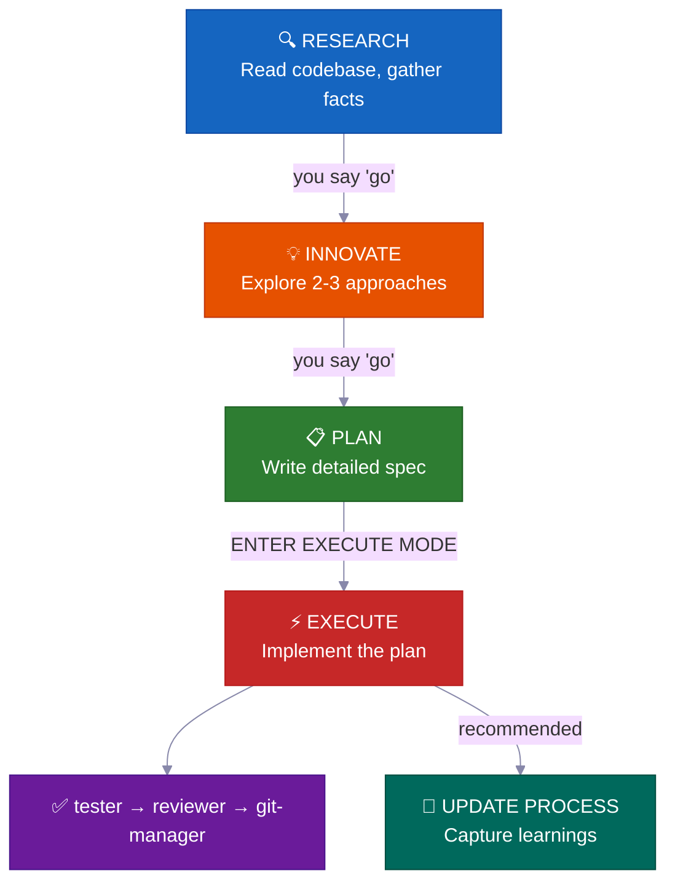
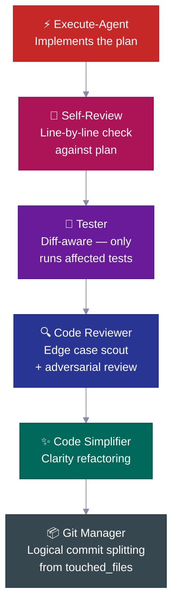
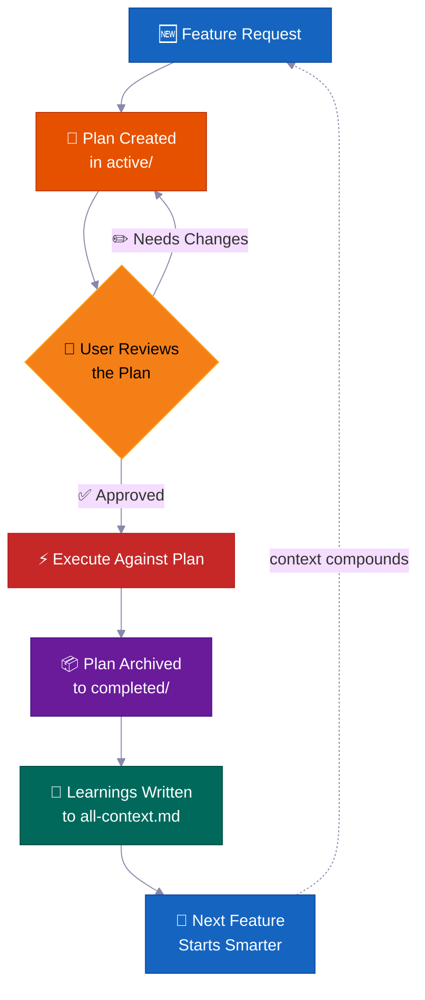
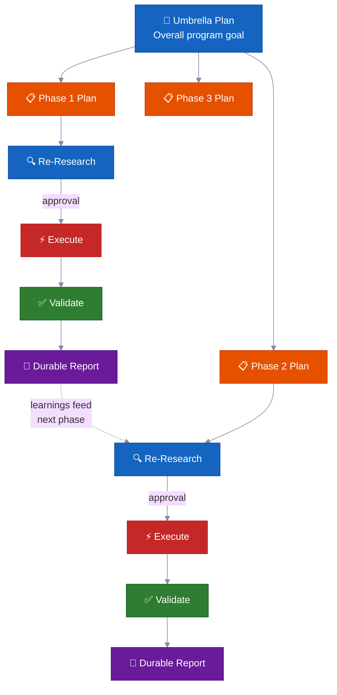

<p align="center">
  <a href="../../README.md">English</a> |
  <a href="README.zh-CN.md">简体中文</a> |
  <a href="README.ja-JP.md">日本語</a> |
  <a href="README.ko-KR.md">한국어</a> |
  <a href="README.vi-VN.md">Tiếng Việt</a> |
  <a href="README.pt-BR.md">Português</a> |
  <a href="README.es.md">Español</a> |
  <a href="README.de.md">Deutsch</a> |
  <a href="README.fr.md">Français</a> |
  <strong>हिंदी</strong>
</p>

<div align="center">

<a href="https://flowser.ai">
  
</a>

*विश्वस्तरीय इंजीनियरों द्वारा निर्मित, vibecoders के लिए*<br>
*[flowser.ai](https://flowser.ai) — GTM के लिए कंप्यूटर वाले AI Agents*

<br>

# vibecode-pro-max-kit

**अपने AI को सोचने से पहले कोड लिखने से रोकें — और आपके हर detailed prompt को भुला देने से भी।<br>यह harness किसी भी AI coding agent को एक spec-driven engineering team में बदल देता है<br>जो research करती है, plan बनाती है, production-grade code ship करती है, और अपनी memory को self-improve करती है — ताकि 6 महीने बाद भी context-rotting से बच सके।**

<br>

<p align="center">
  
  <br><br>
  <em>"पूर्ण एकाग्रता — Spec श्वास, दसवाँ रूप: Vibe Flow कभी नहीं टूटता।"</em><br>
  <strong>— तंजिरो कामादो</strong>
</p>

🔬 AI agents के लिए Spec-driven development<br>
📋 PRDs को auto-generate करता है, backlogs manage करता है, context को automatically route करता है<br>
🧠 Self-improving knowledge base जो ship करने के साथ-साथ बढ़ती रहती है<br>
⚡ बड़े tasks पर बिना state खोए घंटों autonomously चलता है<br>
🤝 Plans और specs shareable हैं — devs, PMs, और stakeholders एक ही artifacts review करते हैं

<p>
  <a href="https://github.com/withkynam/vibecode-pro-max-kit/stargazers"></a>
  <a href="https://github.com/withkynam/vibecode-pro-max-kit/network/members"></a>
  <a href="LICENSE"></a>
  <a href="https://github.com/withkynam/vibecode-pro-max-kit/graphs/contributors"></a>
  <a href="https://github.com/withkynam/vibecode-pro-max-kit/actions/workflows/validate.yml"></a>
  <a href="https://github.com/withkynam/vibecode-pro-max-kit/commits/main"></a>
  
  
  
</p>

<p>
  <strong>सबसे सरल, सबसे flexible, team-friendly coding harness</strong><br><br>
  <a href="https://github.com/anthropics/claude-code"></a>&nbsp;
  <a href="https://github.com/openai/codex"></a>&nbsp;
  <a href="https://cursor.com"></a>&nbsp;
  <a href="https://windsurf.com"></a><br>
  <a href="https://github.com/google-gemini/gemini-cli"></a>&nbsp;
  <a href="https://github.com/opencode-ai/opencode"></a>&nbsp;
  <a href="https://github.com/features/copilot"></a>
</p>

<p>
  <em>किसी भी tech stack, किसी भी language, किसी भी project पर काम करता है</em><br><br>
  <picture>
    <source media="(prefers-color-scheme: dark)" srcset="https://skillicons.dev/icons?i=ts%2Cjs%2Creact%2Cnextjs%2Cvue%2Cnuxt%2Csvelte%2Cangular%2Cnodejs%2Cexpress%2Cbun%2Cpython%2Cdjango%2Cflask%2Cfastapi&theme=dark&perline=15" />
    <source media="(prefers-color-scheme: light)" srcset="https://skillicons.dev/icons?i=ts%2Cjs%2Creact%2Cnextjs%2Cvue%2Cnuxt%2Csvelte%2Cangular%2Cnodejs%2Cexpress%2Cbun%2Cpython%2Cdjango%2Cflask%2Cfastapi&theme=light&perline=15" />
    
  </picture>
  <br>
  <picture>
    <source media="(prefers-color-scheme: dark)" srcset="https://skillicons.dev/icons?i=ruby%2Crails%2Cgo%2Crust%2Cjava%2Cspring%2Ckotlin%2Cswift%2Cphp%2Claravel%2Ccs%2Cdotnet%2Celixir%2Cgraphql%2Cprisma&theme=dark&perline=15" />
    <source media="(prefers-color-scheme: light)" srcset="https://skillicons.dev/icons?i=ruby%2Crails%2Cgo%2Crust%2Cjava%2Cspring%2Ckotlin%2Cswift%2Cphp%2Claravel%2Ccs%2Cdotnet%2Celixir%2Cgraphql%2Cprisma&theme=light&perline=15" />
    
  </picture>
  <br>
  <picture>
    <source media="(prefers-color-scheme: dark)" srcset="https://skillicons.dev/icons?i=supabase%2Cfirebase%2Cpostgres%2Cmongodb%2Credis%2Cdocker%2Ckubernetes%2Caws%2Cgcp%2Cazure%2Cvercel%2Ccloudflare%2Ctailwind%2Celectron&theme=dark&perline=15" />
    <source media="(prefers-color-scheme: light)" srcset="https://skillicons.dev/icons?i=supabase%2Cfirebase%2Cpostgres%2Cmongodb%2Credis%2Cdocker%2Ckubernetes%2Caws%2Cgcp%2Cazure%2Cvercel%2Ccloudflare%2Ctailwind%2Celectron&theme=light&perline=15" />
    
  </picture>
  <br>
  <p><em>यह केवल सजावट नहीं है। जब आप <code>vc-setup</code> चलाते हैं, तो parallel agents आपके codebase को scan करते हैं,<br>
  आपका stack detect करते हैं, और project-specific context groups बनाते हैं जिन्हें हर skill काम करने से पहले पढ़ती है।<br>
  दूसरे harnesses agents को एक language तक hardcode करते हैं — <code>rust-review-agent</code>, <code>python-linter</code> — जो कहीं और बेकार हैं।<br>
  यह ऊपर दिए किसी भी combination के अनुसार adapt होता है और ship करने के साथ-साथ knowledge बढ़ाता जाता है।</em></p>
</p>

</div>

---

## 🚀 Install (30 सेकंड)

> **इसे अपने project folder के अंदर चलाएं।** Terminal खोलें और `cd` करके उस project में जाएं जिसमें harness install करना है — यह current directory में install होता है।
>
> Agent से चलाना पसंद करते हैं? Claude Code या Codex को **उस project folder को working directory बनाकर** खोलें, फिर नीचे दिया [full setup prompt](#-full-agent-setup-prompt) paste करें।

```bash
curl -fsSL https://raw.githubusercontent.com/withkynam/vibecode-pro-max-kit/main/install.sh | bash
```

फिर Claude Code खोलें और कहें:

```
Run vc-setup
```

बस इतना ही। Setup skill आपका stack detect करती है, project के बारे में पूछती है (एक असली बातचीत, checklist नहीं), process directory scaffold करती है, codebase को गहराई से scan करती है, और context files को actual content से भरती है — placeholders से नहीं।

<br>

<details>
<summary><strong>📦 क्या install होता है</strong></summary>

<br>

```
your-project/
├── .claude/
│   ├── agents/              # 🤖 12 specialized agent definitions
│   │   ├── vc-research-agent.md
│   │   ├── vc-execute-agent.md
│   │   └── ...
│   ├── skills/              # ⚡ 31 auto-discovered skills
│   │   ├── vc-generate-plan/
│   │   ├── vc-security/
│   │   ├── vc-scout/
│   │   └── ...
│   └── hooks/               # 🪝 7 lifecycle hooks
│       ├── privacy-block.cjs
│       ├── scout-block.cjs
│       └── ...
├── .codex/
│   └── agents/              # 🔄 Codex के लिए mirrored agents
├── CLAUDE.md                # 📋 Orchestrator + routing rules
├── AGENTS.md                # 📖 Agent registry
└── process/                 # 🧠 vc-setup द्वारा बनाया जाता है (install से नहीं)
    └── ...
```

- **नया project?** पूरा harness install होता है, फिर `vc-setup` आपका codebase study करती है
- **पहले से `.claude/` config है?** `.vibecode-backup/` में backup होता है, fresh install होता है, आपका `settings.json` restore होता है
- **पहले से `process/` directory है?** Install कभी छूती नहीं — `vc-setup` intelligently migration handle करती है
- **पहले से `CLAUDE.md` है?** `CLAUDE.md.pre-vibecode` के रूप में backup होता है, harness version install होता है

</details>

<a id="-full-agent-setup-prompt"></a>

<details>
<summary><strong>🤖 Full agent setup prompt</strong> (maximum control के लिए Claude Code में copy-paste करें)</summary>

> **पहले, Claude Code या Codex को अपने project folder को working directory बनाकर खोलें** (project के अंदर से launch करें, या पहले `cd` करें)। Harness current directory में install होता है, इसलिए यह आपका project होना चाहिए — फिर नीचे का prompt paste करें।

```
First, install the vibecode-pro-max-kit agent harness by running this command:

curl -fsSL https://raw.githubusercontent.com/withkynam/vibecode-pro-max-kit/main/install.sh | bash

After the install completes, run vc-setup to configure everything for this project.

Follow the full interactive flow:

1. DETECT — Read package.json, detect my stack (framework, package manager, monorepo
   structure, test framework, database, auth). Also check if I have any existing .claude/,
   process/, or context files from a previous setup.

2. SHOW ME WHAT YOU FOUND — Present a summary of the detection results and wait for me
   to confirm before continuing. If this is an existing project with process/ folders or
   context files, tell me what you found and what looks good vs what could be improved.

3. ASK ME ABOUT THE PROJECT — Before scaffolding or scanning, have a real conversation
   with me about this project. Don't just ask a fixed list of questions and move on — ask
   follow-ups based on my answers, probe deeper on anything vague, and keep going until
   you genuinely understand the project. Start with the basics (what is this? who uses it?),
   then dig into architecture, features, conventions, pain points, and anything else that
   matters. Summarize your understanding back to me and confirm it's correct before moving on.

4. SCAFFOLD — Create the process/ directory structure. If I already have process/ folders,
   show me what you plan to change and wait for my approval before reorganizing anything.
   Never silently move or delete my existing files.

5. STUDY — Deep-scan the codebase and populate process/context/all-context.md with REAL
   content based on what you find AND what I told you. Include: repo structure, tech stack
   with versions, key patterns and conventions, import aliases, env vars, API routes,
   database schema, test setup. Do not leave placeholder text.

6. VALIDATE — Run all the validation checks to make sure everything is wired correctly.

Important rules:
- If I have existing context files or a well-written CLAUDE.md, read them first and
  preserve what is good. Merge intelligently — do not replace good content with generic scans.
- Show me a summary of what you plan to create or change at each major step and wait
  for my OK before proceeding.
- Do not create empty placeholder files. Only create files that have real content.
- Ask before reorganizing. If my existing setup works, tell me what you would improve
  and let me decide.
```

</details>

<br>

<details>
<summary>विषय सूची</summary>

- [समस्या](#-the-problem)
- [समाधान](#-the-fix)
- [Vibe Coding Revolution](#the-vibe-coding-revolution)
- [यह किसके लिए है?](#who-is-this-for)
- [एक नज़र में](#at-a-glance)
- [Teams यह क्यों उपयोग करती हैं](#-why-teams-use-this)
- [तुलना](#how-this-compares)
- [यह अलग क्यों है](#-what-makes-this-different)
- [अंदर क्या है](#-whats-inside)
- [यह कैसे काम करता है](#-how-it-works)
- [Built-in Safety Systems](#-built-in-safety-systems)
- [योगदान](#contributing)
- [Star History](#-star-history)

</details>

---

## 🔥 समस्या

आप Claude से कहते हैं "webhook support add करो।" वह तुरंत code लिखने लगता है। आपके architecture के बारे में कोई सवाल नहीं। Existing patterns की कोई जांच नहीं। कोई plan नहीं। आपको 400 लाइनें मिलती हैं जो codebase में fit नहीं होतीं, और आप उन्हें ठीक करने में एक घंटा लगाते हैं।

**लेकिन यह तो बस ऊपरी परत है।** असली गहरी समस्याएं और ज़्यादा तकलीफ देती हैं:

<table>
<tr>
<td width="50%" valign="top">
<h1>🧠</h1>
<strong>हर session में context मर जाता है</strong><br><br>
आपका agent सब कुछ भूल जाता है जो उसने सीखा था। वही गलतियां, वही सवाल, हर बार। कोई memory नहीं, कोई compounding knowledge नहीं।
</td>
<td width="50%" valign="top">
<h1>📄</h1>
<strong>Docs तुरंत पुराने पड़ जाते हैं</strong><br><br>
आपने पिछले हफ्ते बढ़िया context docs लिखे थे। वे पहले ही outdated हो चुके हैं। codebase evolve होने के साथ कुछ भी auto-update नहीं होता।
</td>
</tr>
<tr>
<td width="50%" valign="top">
<h1>💥</h1>
<strong>बड़े tasks बीच में collapse हो जाते हैं</strong><br><br>
Context window भर जाता है, state खो जाती है, agent hallucinate करने लगता है। तीसरे घंटे में आप scratch से restart करते हैं।
</td>
<td width="50%" valign="top">
<h1>🤝</h1>
<strong>कोई spec नहीं, कोई review नहीं, कोई collaboration नहीं</strong><br><br>
आपका PM review नहीं कर सकता कि agent क्या बनाने वाला है। Code लिखे जाने से पहले share, discuss या approve करने के लिए कोई artifact नहीं है।
</td>
</tr>
<tr>
<td width="50%" valign="top">
<h1>🎭</h1>
<strong>Architecture decisions hallucinated होती हैं</strong><br><br>
Agent यह research करने की बजाय कि दूसरे codebases ने उसी problem को कैसे solve किया, patterns खुद गढ़ लेता है।
</td>
</tr>
</table>

**आपके agent के पास intelligence है, लेकिन कोई process नहीं, कोई memory नहीं, और आपकी team के साथ collaborate करने का कोई तरीका नहीं।**

चाहे आप developer हों, PM हों, या CEO जिसने अभी vibe coding शुरू की हो — यह समस्या सबको एक जैसे लगती है। समाधान भी एक ही है: **अपने agent को एक असली development process दें।**

---

## 🛠️ समाधान

यह harness आपके project में एक पूरा development system install करता है — सिर्फ एक CLAUDE.md file नहीं, बल्कि **12 specialized agents, 31 skills**, और एक phase-locked workflow जो आपके agent को **build करने से पहले समझने** पर मजबूर करता है।

<br>

<table>
<tr>
<td align="center" width="50%" valign="top">
<h1>📋</h1>
<strong>Spec-driven plans</strong><br><br>
<sub>PMs और devs code लिखे जाने से पहले एक ही plan artifact review करते हैं</sub>
</td>
<td align="center" width="50%" valign="top">
<h1>🔄</h1>
<strong>Self-improving context</strong><br><br>
<sub>हर feature ship होने पर auto-update होता है — docs कभी stale नहीं होते</sub>
</td>
</tr>
<tr>
<td align="center" width="50%" valign="top">
<h1>⚡</h1>
<strong>Autonomous execution</strong><br><br>
<sub>Context compaction से बचता है — मिनटों नहीं, घंटों तक चलता है</sub>
</td>
<td align="center" width="50%" valign="top">
<h1>🧬</h1>
<strong>Architecture research</strong><br><br>
<sub>Design decisions लेने से पहले real codebases study करता है</sub>
</td>
</tr>
<tr>
<td align="center" width="50%" valign="top">
<h1>🧭</h1>
<strong>Smart context routing</strong><br><br>
<sub>सिर्फ relevant चीज़ें load करता है — हर बार पूरा knowledge base नहीं</sub>
</td>
</tr>
</table>

<br>



हर transition के लिए आपकी **explicit approval** ज़रूरी है। कुछ भी auto-advance नहीं होता। आप control में रहते हैं।

---

## The Vibe Coding Revolution

<div align="center">
<h3><em>"सबसे hot नई programming language English है।"</em></h3>
<strong>— Andrej Karpathy</strong>
</div>

<br>

**Vibe coding ने यह बदल दिया कि software कौन बना सकता है। Spec-driven development यह बदलता है कि वे क्या ship कर सकते हैं।**

<table>
<tr>
<td align="center" width="50%">
<h3>63%</h3>
<sub>vibe coding users <strong>developers नहीं हैं</strong></sub>
</td>
<td align="center" width="50%">
<h3>16.2M</h3>
<sub>दुनिया भर में citizen developers<br>(38% YoY growth)</sub>
</td>
</tr>
<tr>
<td align="center" width="50%">
<h3>$4.7B</h3>
<sub>vibe coding market<br>38% सालाना बढ़ रहा है</sub>
</td>
<td align="center" width="50%">
<h3>25%</h3>
<sub>YC W25 startups में 95%+ AI-generated codebases थे</sub>
</td>
</tr>
</table>

ज़्यादातर tools आपको project शुरू करने में मदद करते हैं। यह harness आपको **उसे finish करने** में मदद करता है — ऐसे plans के साथ जिन्हें आपकी team review कर सके, context जो कभी stale न हो, और safety systems जो गलतियों को ship होने से पहले पकड़ें।

---

## यह किसके लिए है?

<div align="center">
<h3><em>"मायने यह नहीं रखता कि किसने type किया। मायने यह रखता है कि क्या ship हुआ।"</em></h3>
<strong>— Garry Tan, YC</strong>
</div>

<br>

चाहे आपने अभी vibe coding discover की हो या आप production systems ship करने वाले staff engineer हों — यह harness आपके workflow के अनुसार adapt होता है।

<table>
<tr>
<td width="50%" valign="top">
<h1>🧑‍💼</h1>
<strong>CEO / Founder</strong><br><br>
<em>"मेरे लिए auth, billing और landing page के साथ एक SaaS बनाओ"</em><br><br>
Agent आपका stack research करता है, एक architecture plan लिखता है जिसे आप review कर सकते हैं, tests के साथ implement करता है, और हर decision को capture करता है ताकि आपका technical co-founder बाद में audit कर सके।
</td>
<td width="50%" valign="top">
<h1>📊</h1>
<strong>Product Manager</strong><br><br>
<em>"MRR, churn और growth metrics दिखाने वाला dashboard बनाओ"</em><br><br>
यह PRD-style spec generate करता है, code लिखने से पहले आपकी approval लेता है, spec के अनुसार implement करता है, और plan को searchable project history के रूप में archive करता है।
</td>
</tr>
<tr>
<td width="50%" valign="top">
<h1>🎨</h1>
<strong>Designer</strong><br><br>
<em>"इस Figma screenshot को pixel-perfect match करो"</em><br><br>
Design-aware agent आपका mockup analyze करता है, आपके design tokens के साथ component-by-component implement करता है, और visual comparison checks spawn करता है।
</td>
<td width="50%" valign="top">
<h1>⚙️</h1>
<strong>Engineer</strong><br><br>
<em>"Auth module को zero downtime के साथ RBAC support करने के लिए refactor करो"</em><br><br>
यह आपका current auth code और दूसरे codebases ने RBAC को कैसे solve किया, दोनों research करता है, blast radius analysis के साथ migration plan लिखता है, rollback notes के साथ safely implement करता है।
</td>
</tr>
</table>

---

## एक नज़र में

<table>
<tr>
<td align="center" width="50%" valign="top">
<h1>🤖</h1>
<h3>12</h3>
<strong>Specialized Agents</strong><br>
<sub>Domain experts जो हर development phase own करते हैं</sub>
</td>
<td align="center" width="50%" valign="top">
<h1>⚡</h1>
<h3>32</h3>
<strong>Auto-Discovered Skills</strong><br>
<sub>Keyword matching से surface होने वाली reusable capabilities</sub>
</td>
</tr>
<tr>
<td align="center" width="50%" valign="top">
<h1>🪝</h1>
<h3>7</h3>
<strong>Lifecycle Hooks</strong><br>
<sub>Pre/post execution guardrails और context injection</sub>
</td>
<td align="center" width="50%" valign="top">
<h1>📜</h1>
<h3>6</h3>
<strong>Development Protocols</strong><br>
<sub>सभी tools पर shared workflow rules</sub>
</td>
</tr>
<tr>
<td align="center" width="50%" valign="top">
<h1>🛡️</h1>
<h3>5</h3>
<strong>Safety Systems</strong><br>
<sub>Phase-locking, blast radius, privacy, leak detection</sub>
</td>
<td align="center" width="50%" valign="top">
<h1>🔧</h1>
<h3>7</h3>
<strong>Supported Tools</strong><br>
<sub>Claude Code, Codex, Cursor, Windsurf, Antigravity, OpenCode, Copilot</sub>
</td>
</tr>
<tr>
<td align="center" width="50%" valign="top">
<h1>🌍</h1>
<h3>6</h3>
<strong>भाषाएं</strong><br>
<sub>EN · 中文 · 日本語 · 한국어 · Tiếng Việt · Português</sub>
</td>
<td align="center" width="50%" valign="top">
<h1>⚡</h1>
<h3>30s</h3>
<strong>Install Time</strong><br>
<sub>एक curl command + auto-setup बाकी सब करता है</sub>
</td>
</tr>
</table>

---

## 💎 Teams यह क्यों उपयोग करती हैं

> ज़्यादातर harnesses आपको एक CLAUDE.md और instructions देते हैं। यह आपको एक **autonomous development system** देता है जो समय के साथ intelligence compound करता है।

<br>

### 📋 Spec-Driven Development — Vibes-Driven नहीं

हर feature को code की एक भी लाइन लिखे जाने से पहले **blast radius analysis के साथ एक written plan** मिलती है।

> 💡 PRDs auto-generate करता है, backlogs manage करता है, feature groups organize करता है। Developers और product managers दोनों के लिए काम करता है — आपका agent senior engineer की तरह plan करता है, intern की तरह नहीं।

**हर plan में क्या होता है:**

| Section | उद्देश्य |
|---|---|
| 📍 **Touchpoints** | हर वह file जो बनाई या modify की जाएगी, upfront listed |
| 📜 **Public contracts** | कौन से API surfaces या interfaces बदलते हैं |
| 💥 **Blast radius** | क्या break हो सकता है, कौन से tests चलाने हैं, क्या देखना है |
| ✅ **Verification evidence** | Implementation सही है यह कैसे साबित करें |
| 🔄 **Resume handoff** | किसी भी agent के लिए mid-plan pick up करने के लिए पर्याप्त context |

<br>

### 🔄 Autonomous Multi-Phase Execution — घंटों का Hands-Free काम

बड़े tasks के लिए, agent एक **iterative phased loop** चलाता है:

```
🔍 research → ⚡ execute → ✅ validate → 📄 report → 🔄 repeat
```

> 💡 यह stuck होने पर self-heal करता है, approach improve करने के लिए self-reflect करता है, और durable progress reports disk पर लिखता है। **Context compaction इसे नहीं मार सकता** — सारी state files में रहती है, memory में नहीं।

जाइए और वापस आइए — काम पूरा मिलेगा।

<br>

### 🧬 Auto-Architecture Research — किसी भी Codebase से सीखें

Agent सिर्फ आपका code नहीं पढ़ता — यह **दूसरे repositories study करता है** यह जानने के लिए कि उन्होंने similar problems कैसे solve किए (`vc-xia`)।

> 💡 यह research करता है, approaches compare करता है, और best patterns को आपके codebase में adapt करता है। Architecture decisions real-world implementations से informed होते हैं, hallucinated best practices से नहीं।

<br>

### 🧭 Persistent Smart Context Routing — हमेशा सही Context

Context एक giant file नहीं है। यह **auto-routed knowledge domains** में organized है:

```
process/context/
├── all-context.md              # 🧭 Root router — आपका task पढ़ता है, relevant चीज़ें load करता है
├── tests/
│   └── all-tests.md            # 🧪 Test runners, commands, debugging
├── container/
│   └── all-container.md        # 🐳 Docker, deployment, infra
├── uxui/
│   └── all-uxui.md             # 🎨 Components, design tokens, patterns
└── {your-domain}/
    └── all-{domain}.md         # 📚 3+ durable docs वाला कोई भी domain
```

> 💡 जब agent billing पर काम करता है, तो billing context load होती है — पूरे codebase docs नहीं। Context **हर बार feature complete होने पर auto-update होता है**, इसलिए कभी stale नहीं होता।

<br>

### 🧠 Self-Improving Knowledge Base — Ship करते-करते और स्मार्ट होता है

हर completed feature learnings को context system में वापस feed करती है।

> 💡 Research findings, architectural decisions, debugging insights, और coding patterns **automatically capture और index होते हैं**। आपकी 100वीं feature को पहली 99 में सीखी गई हर चीज़ का फायदा मिलता है। Knowledge compound होती है — reset नहीं।

---

## तुलना

| Feature | vibecode-pro-max-kit | Superpowers | GSD | gstack |
|---------|---------------------|-------------|-----|--------|
| Spec-driven lifecycle | Full RIPER-5 (research → plan → execute → verify) | Mandatory workflows | Context-rot fix | Partial |
| Phase-locked safety | Tool restrictions per mode (read-only research, no-write innovate) | Skill-based constraints | Phase separation | None |
| Multi-tool support | 7 tools via AGENTS.md + native | Claude Code plugin | 14 runtimes | 1 tool |
| Auto-improving context | Domain-routed context groups, updates after every feature | Plugin memory | Disk-persisted state | Manual |
| Team collaboration | Shared specs, plans, and review artifacts | Solo | Solo | Solo |
| Skills system | 32 auto-discovered, keyword-matched at every prompt | 86 composable skills | Meta-prompting | 23 role tools |
| Multi-phase programs | Umbrella plans + phase-by-phase execution loop with regression checks | Single task | Single task | Single task |
| Quality pipeline | 6-step chain (code-review → test → simplify → security → audit → commit) | Per-skill quality | No auto-chain | No auto-chain |
| Installation | 30-second `curl` install + auto-setup | Plugin marketplace | npx one-liner | git clone |
| Context routing | Domain-based routing table with grouped context packs | Flat skill context | Flat context | Single file |

> **Runtime breadth के बारे में:** GSD 14 runtimes support करता है। हम 7 को गहराई से support करते हैं — हर platform पर full agent harnesses, skill discovery, और lifecycle hooks के साथ। Breadth बनाम depth: आपकी पसंद।

---

## ⚡ यह अलग क्यों है

ज़्यादातर agent harnesses आपको एक बड़ा CLAUDE.md और कुछ instructions देते हैं। यह वास्तव में क्या करता है:

<br>

<table>
<tr>
<td width="50%" valign="top">
<h1>🔒</h1>
<strong>Phase-Locked Tool Restrictions</strong><br><br>
आपका agent research के दौरान literally <strong>code नहीं लिख सकता</strong>। RESEARCH read-only है, INNOVATE में Bash नहीं है, PLAN सिर्फ <code>process/</code> में लिख सकता है। <strong>वास्तविक capability removal</strong>, suggestions नहीं।
</td>
<td width="50%" valign="top">
<h1>🎯</h1>
<strong>Smart Auto-Routing</strong><br><br>
Natural language से आपका intent detect करता है। "build webhook support" → full pipeline। "login is broken" → debugger। 6-level precedence, अधिकतम एक clarifying question।
</td>
</tr>
<tr>
<td width="50%" valign="top">
<h1>🔍</h1>
<strong>Automatic Skill Discovery</strong><br><br>
किसी भी request को route करने से पहले, <strong>32 skills</strong> scan करता है और keywords match करता है। "add webhook support" कहें और <code>vc-security</code> + <code>vc-scenario</code> automatically surface हो जाते हैं।
</td>
<td width="50%" valign="top">
<h1>💾</h1>
<strong>Context Compaction से बचता है</strong><br><br>
Plans, reports, context docs, और learnings सब disk पर रहते हैं। Session-init hook compaction के बाद approval gates re-inject करता है। <strong>कुछ भी नहीं खोता।</strong>
</td>
</tr>
<tr>
<td width="50%" valign="top">
<h1>🛡️</h1>
<strong>Self-Policing Violation Detection</strong><br><br>
जब agent किसी phase boundary को cross करने वाला होता है, तो वह खुद रुक जाता है: <em>"PHASE JUMPING PREVENTED"</em>। एक <strong>structural hallucination guard</strong>।
</td>
<td width="50%" valign="top">
<h1>🔄</h1>
<strong>7 AI Coding Tools पर काम करता है</strong><br><br>
दो open standards — <code>AGENTS.md</code> और <code>SKILL.md</code> — का मतलब है <strong>zero adapters, zero plugins, zero configuration।</strong> Claude Code में शुरू करें, Cursor में switch करें, Codex में जारी रखें।
</td>
</tr>
</table>

---

## 🧭 यह कैसे काम करता है

```
आपका request
  → Step 0: Skill Discovery (keywords match करें → relevant skills surface करें)
  → Intent Detection (feature / bug / question / refactor / UI)
  → सही agent को route करें
  → Explicit transitions के साथ phase-locked execution
```

Orchestrator **खुद कभी काम नहीं करता** — यह route, monitor, और transitions manage करता है।

<br>

### 📊 Workflow

| Phase | क्या होता है | आप कहते हैं |
|-------|-------------|---------|
| 🔍 **RESEARCH** | Read-only fact gathering — codebase + web | *(feature requests पर automatic)* |
| 💡 **INNOVATE** | Trade-offs के साथ 2-3 approaches explore करना | `go` |
| 📋 **PLAN** | एक detailed spec लिखना जिसे आप review कर सकें | `go` |
| ⚡ **EXECUTE** | बिल्कुल plan के अनुसार implement करना | `ENTER EXECUTE MODE` |
| 🧠 **UPDATE PROCESS** | Learnings capture करना, context update करना, plan archive करना | *(non-trivial काम के बाद recommended)* |

> 💡 **Shortcuts:** `ENTER FAST MODE - [task]` RESEARCH+INNOVATE+PLAN को एक pass में compress करता है — EXECUTE से पहले फिर भी pause करता है। Trivial fixes (single file, <15 lines, कोई schema/auth changes नहीं) सीधे execute पर जाती हैं।

<br>

### 💻 Typical Session

```
# 🆕 Feature request
आप: "API में webhook support add करो"
→ Skill discovery surface करता है: vc-scenario, vc-security
→ research-agent context gather करता है (read-only, code नहीं छू सकता)
→ आप "go" कहते हैं → innovate-agent approaches explore करता है
→ आप "go" कहते हैं → plan-agent blast radius के साथ spec लिखता है
→ आप plan review करते हैं, "ENTER EXECUTE MODE" कहते हैं
→ execute-agent implement करता है → self-review → tester → code-reviewer → git-manager
→ Closeout packet: क्या बदला, क्या verified है, recommended next step
```

```
# 🐛 Bug fix
आप: "login redirect broken है"
→ vc-debugger को route → evidence gathering → competing hypotheses
→ Proof chain के साथ root cause identify होती है
→ execute-agent fix implement करता है → quality pipeline
```

```
# ⏩ Fast mode
आप: "ENTER FAST MODE - rate limiting middleware add करो"
→ Compressed research+innovate+plan एक pass में
→ Mandatory safety pause → आप review करते हैं → "ENTER EXECUTE MODE"
```

```
# 🏗️ Large program
आप: "full testing platform बनाओ"
→ Feature folder में umbrella plan + phase plans बनाता है
→ हर phase: re-research → approve → execute → validate → durable report
→ Progress context compaction से बचती है — durable reports disk पर
```

```
# 🔄 Autonomous optimization
आप: "vc-autoresearch का उपयोग करके test coverage 80% तक improve करो"
→ Agent iterate करता है: change करो → commit → measure → keep/revert
→ 5 consecutive discards के बाद stuck detection → strategy shift
→ TSV में full audit trail
```

---

## 🛡️ Built-in Safety Systems

ये सिर्फ guidelines नहीं हैं — ये हर agent में built **structural enforcement** है।

<table>
<tr>
<td width="50%" valign="top">
<h1>⏸️</h1>
<strong>50% Mid-Implementation Check-In</strong><br><br>
Execution के लगभग आधे रास्ते पर, agent <strong>pause करता है</strong> progress report देने के लिए, completed और remaining items list करने के लिए, और पूछता है: <em>"Current approach से जारी रखें या PLAN पर वापस जाएं?"</em>
</td>
<td width="50%" valign="top">
<h1>🚫</h1>
<strong>कभी चुपचाप Deviate नहीं करता</strong><br><br>
अगर execute-agent को plan से deviation की ज़रूरत पड़ती है, तो वह <strong>तुरंत रुक जाता है</strong>, issue explain करता है, और PLAN mode पर वापस आता है। कोई quiet improvising नहीं।
</td>
</tr>
<tr>
<td width="50%" valign="top">
<h1>🔙</h1>
<strong>Approach Abandonment Protocol</strong><br><br>
जब कोई approach fail होती है, agent reusable components evaluate करता है, deletion से पहले lessons document करता है, abandonment summary बनाता है, और PLAN पर वापस आता है।
</td>
<td width="50%" valign="top">
<h1>🔐</h1>
<strong>Privacy Guardrails Hook</strong><br><br>
Agent को <code>.env</code>, credentials, SSH keys, और <code>.pem</code> files पढ़ने से <strong>block किया जाता है</strong>। Explicit approval मांगनी होती है।
</td>
</tr>
<tr>
<td width="50%" valign="top">
<h1>⚠️</h1>
<strong>High-Risk Evidence Packs</strong><br><br>
Auth, billing, schema migrations, या public APIs को touch करने वाले changes के लिए — system काम को "done" कहने से पहले formal evidence pack require करता है।
</td>
<td width="50%" valign="top">
<h1>📊</h1>
<strong>Drift Signal Scoring</strong><br><br>
Execution के बाद, system urgency score करता है: <strong>LOW</strong> (light touch), <strong>MEDIUM</strong> (significant changes), <strong>HIGH</strong> (harness/protocol files touched)।
</td>
</tr>
</table>

---

## 🔍 Pre-Implementation Intelligence

Code की एक भी लाइन लिखे जाने से पहले, system specialized analysis से issues पकड़ सकता है:

<br>

<table>
<tr>
<td width="50%" valign="top">
<h1>🎭</h1>
<strong>5-Persona Pre-Implementation Debate</strong><br><br>
<code>vc-predict</code> — Architect, Security, Performance, UX, और Devil's Advocate आपके plan पर debate करते हैं। Code की एक लाइन लिखने से पहले <strong>GO / CAUTION / STOP</strong> verdict देता है।
</td>
<td width="50%" valign="top">
<h1>🎲</h1>
<strong>12-Dimension Edge Case Generator</strong><br><br>
<code>vc-scenario</code> — किसी भी feature को 12 dimensions में decompose करता है (user types, input extremes, timing, scale, state, env, errors, auth, data, integrations, compliance, business logic)। Output test specs के रूप में उपयोग करने योग्य।
</td>
</tr>
<tr>
<td width="50%" valign="top">
<h1>🔐</h1>
<strong>STRIDE + OWASP Security Audit</strong><br><br>
<code>vc-security</code> — Dependency auditing, secret detection, और <strong>auto-fix mode</strong> के साथ dual-methodology security audit जो severity से sort करता है और पहले Critical को regression guards के साथ fix करता है।
</td>
</tr>
</table>

---

## 🤖 Autonomous Agent Capabilities

<br>

<table>
<tr>
<td width="50%" valign="top">
<h1>🔄</h1>
<strong>Autonomous Metric Optimization</strong><br><br>
<code>vc-autoresearch</code> — Goal set करें, चले जाएं। Iterative git-backed loop: ONE atomic change करें → commit → measure → keep या revert। 5 consecutive discards के बाद stuck detection strategy shifts trigger करता है।
</td>
<td width="50%" valign="top">
<h1>👥</h1>
<strong>Parallel Agent Teams</strong><br><br>
<code>vc-team</code> — Multiple agents <strong>simultaneously</strong> git worktree isolation के साथ काम करते हैं। Parallel में research, parallel में execute, parallel में review, adversarially debug।
</td>
</tr>
<tr>
<td width="50%" valign="top">
<h1>🔬</h1>
<strong>Evidence-Before-Hypothesis Debugging</strong><br><br>
<code>vc-debugger</code> — पहले evidence gather करता है → 2-3 competing hypotheses बनाता है → systematically हर एक test करता है → elimination path document करता है। <strong>कभी guess नहीं करता — prove करता है।</strong>
</td>
</tr>
</table>

---

## ✅ Quality Pipeline — Execution में Built

Execute-agent सिर्फ code लिखकर done नहीं कहता। यह automatically एक **quality pipeline** से गुज़रता है:

<br>



<br>

| Step | क्या करता है |
|---|---|
| 🔎 **Self-review** | Deviations के लिए plan के विरुद्ध हर checklist item check करता है, document करता है |
| 🧪 **Tester** | Changed files को test files से map करता है, >70% mapped होने पर full suite तक auto-escalate करता है |
| 🔍 **Code reviewer** | Review से पहले edge case scout dispatch करता है, N+1 queries, auth paths, data leaks check करता है |
| ✨ **Simplifier** | Review pass होने के बाद clarity refactoring — कोई behavior changes नहीं |
| 📦 **Git manager** | `touched_files` list receive करता है, logical conventional commits में split करता है, unknown files refuse करता है |

---

## 📋 Plan Lifecycle — Spec-Driven, Vibes-Driven नहीं

हर non-trivial feature एक **plan lifecycle** follow करती है — एक written spec जो बनाई जाती है, review होती है, उसके विरुद्ध execute होती है, और project history के रूप में archive होती है।

<br>



<br>

> 💡 छह महीने बाद, जब कोई पूछेगा *"हमने auth इस तरह क्यों बनाया?"*, तो जवाब `completed/` में होगा। किसी Slack thread में खोया नहीं।

<br>

**Plans disk पर कहाँ रहते हैं:**

```
process/
├── general-plans/
│   ├── active/                  # 📋 Plans जिन पर अभी काम चल रहा है
│   │   └── webhooks_PLAN_28-05-26.md
│   ├── completed/               # ✅ Archived plans (searchable history)
│   ├── backlog/                 # 📌 Deferred काम
│   ├── reports/                 # 📄 Cross-cutting reports
│   └── references/              # 📚 Research outputs
└── features/
    └── billing/                 # 🏷️ Feature-scoped (5+ artifacts)
        ├── active/
        ├── completed/
        ├── backlog/
        ├── reports/
        └── references/
```

---

## 🏗️ Phase Programs — बड़े Projects जो बिखरते नहीं

Normal features एक plan use करती हैं। **बड़े multi-phase projects** phase program use करते हैं — एक umbrella plan plus individual phase plans, हर एक का अपना validation gate होता है।

<br>



<br>

**मुख्य features:**

| | Feature | क्यों ज़रूरी है |
|---|---|---|
| 🔄 | **हर phase पर Re-research** | Code drift check करता है, latest reports पढ़ता है, assumptions update करता है |
| ✅ | **Validation gates** | Phase `VERIFIED` नहीं है जब तक evidence prove न करे। Honest status: `PLANNED` → `CODE DONE` → `TESTING` → `VERIFIED` या `BLOCKED` |
| 📄 | **Durable reports** | हर phase results disk पर लिखती है। Progress context compaction से बचती है |
| 🧠 | **Learnings आगे feed होती हैं** | Phase 1 की discoveries execution से पहले Phase 2 के plan को update करती हैं |
| 🏗️ | **Foundation बनाम expansion** | "Architecture prove करो" और "सब कुछ implement करो" को explicitly split करता है |
| 🚧 | **Honest blocker handling** | Blocked phases evidence के साथ `BLOCKED` रहती हैं। कोई green status force नहीं होता |

---

## 🧠 Context Groups — Organized Knowledge, एक Giant File नहीं

Project knowledge **context groups** में organized है — durable knowledge domains, हर एक का अक्ल `all-{group}.md` router है जो agents को बताता है कि क्या पढ़ना है और कब।

<br>

```
process/context/
├── all-context.md              # 🧭 Root router — architecture, stack, patterns, conventions
├── tests/
│   └── all-tests.md            # 🧪 Test runners, commands, debugging procedures
├── container/
│   └── all-container.md        # 🐳 Docker, deployment, infra procedures
├── uxui/
│   └── all-uxui.md             # 🎨 Components, design tokens, patterns
├── infra/
│   └── all-infra.md            # 🖥️ Worker nodes, provisioning, DNS
├── skills/
│   └── all-skills.md           # ⚡ Skill runtime, app architecture
├── workflows/
│   └── all-workflows.md        # 🔄 Workflow runtime, deployment
└── {your-domain}/
    └── all-{domain}.md         # 📚 3+ durable docs वाला कोई भी knowledge domain
```

<br>

| | कैसे काम करता है |
|---|---|
| 🧭 **Router pattern** | Agents सिर्फ वही पढ़ते हैं जो उनके task के लिए relevant है, सब कुछ नहीं |
| 📏 **Auto-promotion** | 3+ docs या 800+ lines वाले topics को अपना context group मिलता है |
| 🔄 **Living docs** | हर non-trivial feature के बाद `update-process-agent` द्वारा update होते हैं |
| 🧪 **Auditable** | `vc-audit-context` routing और consistency verify करता है |

---

## 📁 Feature Folders — Self-Organizing Project Memory

जब किसी topic पर 5+ artifacts जमा हो जाते हैं, तो उसे अपना **feature folder** मिलता है — एक complete lifecycle container।

<br>

```
process/features/{feature}/
├── active/       # 📋 Plans जिन पर अभी काम चल रहा है
├── completed/    # ✅ Archived plans (searchable decision history)
├── backlog/      # 📌 Deferred काम (agents duplicate बनाने से पहले check करते हैं)
├── reports/      # 📄 Execution reports, post-mortems, validation results
└── references/   # 📚 Research outputs जो future decisions inform करते हैं
```

<br>

| | क्या होता है |
|---|---|
| 🆕 | नया काम `active/` में शुरू होता है → reports जमा होती हैं → plan `completed/` में archive होता है |
| 📌 | Deferred काम `backlog/` में जाता है — agents duplicate plans बनाने से पहले check करते हैं |
| 📦 | Feature promotion automatically होती है जब general artifacts 5+ hit करते हैं |
| 🔍 | हर feature का complete, self-contained history — plans, decisions, reports, research |

---

## 🤖 अंदर क्या है

<br>

### 12 Agents

<details>
<summary>Agent list देखने के लिए click करें (12 agents)</summary>

<br>

**Core workflow agents** — हर RIPER-5 phase के लिए एक:

| Agent | भूमिका |
|-------|------|
| 🔍 `vc-research-agent` | Codebase + web research, read-only। Contradiction tracking built in |
| 💡 `vc-innovate-agent` | 2-3 approaches brainstorm करें। PLAN से पहले decision summary produce करनी होगी |
| 📋 `vc-plan-agent` | Anti-rationalization guards के साथ spec लिखें। "मुझे पहले से पता है" कोई plan नहीं है |
| ⚡ `vc-execute-agent` | Plan के अनुसार implement करें। 50% check-in, deviation protocol, self-review |
| ⏩ `vc-fast-mode-agent` | Mandatory safety pause के साथ compressed RESEARCH→INNOVATE→PLAN |
| 🧠 `vc-update-process-agent` | Stale artifact scanning सहित 7-phase mandatory checklist |

<br>

**Specialist agents** — EXECUTE के दौरान या standalone:

| Agent | भूमिका |
|-------|------|
| 🐛 `vc-debugger` | Evidence-before-hypothesis। Competing hypotheses, elimination chains |
| 🧪 `vc-tester` | Diff-aware। केवल affected tests run करता है। Config changes पर auto-escalate |
| 🔎 `vc-code-reviewer` | Review से पहले edge case scout। N+1 detection, auth path validation |
| ✨ `vc-code-simplifier` | Behavior change के बिना clarity refactoring |
| 🎨 `vc-ui-ux-designer` | Design-aware frontend। Execution के बीच में research subagent spawn कर सकता है |
| 📦 `vc-git-manager` | `touched_files` से logical commit splitting। Unknown files refuse करता है |

</details>

<br>

### 31 Skills (auto-discovered)

<details>
<summary>Skill list देखने के लिए click करें (31 skills)</summary>

<br>

**🔧 Contract skills** — `vc-generate-plan` · `vc-generate-context` · `vc-audit-context` · `vc-audit-plans` · `vc-audit-vc` · `vc-setup` · `vc-update` · `vc-publish`

**🧠 Planning** — `vc-predict` (5-persona debate) · `vc-scenario` (12-dimension edge cases) · `vc-sequential-thinking` · `vc-problem-solving`

**🐛 Debug & security** — `vc-debug` · `vc-security` (STRIDE + OWASP + auto-fix) · `vc-autoresearch` (autonomous optimization)

**📚 Research** — `vc-docs-seeker` · `vc-scout` · `vc-docs` · `vc-repomix` · `vc-xia` (repo comparison)

**🎨 Frontend** — `vc-frontend-design` · `vc-chrome-devtools` · `vc-agent-browser` · `vc-web-testing`

**⚙️ Utilities** — `vc-context-engineering` · `vc-mcp-management` · `vc-preview` · `vc-team` (parallel agents) · `vc-tech-graph` · `vc-watzup` (session handoff) · `vc-merge-worktree`

</details>

> 💡 कुछ skills (जैसे `vc-xia`) [@mrgoonie](https://github.com/mrgoonie) के [ClaudeKit](https://claudekit.cc/?ref=OEOM7R7G) से inspired हैं। हमने 80+ की बजाय कम, गहरी skills पर focus किया।

<br>

### 🪝 7 Hooks

| Hook | क्या करता है |
|------|-------------|
| 🔐 **Privacy guardrails** | `.env`, credentials, SSH keys block करता है। Explicit approval चाहिए |
| 🚫 **Scout blocker** | Agent को `node_modules/`, `dist/` में भटकने से रोकता है। Gitignore-syntax `.ckignore` |
| 🧠 **Session init** | Stack detect करता है, env vars inject करता है, compaction के बाद approval gates recover करता है |
| 💉 **Subagent context** | हर subagent में ~200 token compact context block inject करता है |
| ✨ **Edit quality** | 5+ edits के बाद, code-simplifier run करने का सुझाव देता है (non-blocking, throttled) |
| 📛 **Descriptive naming** | हर Write पर language-aware file naming conventions |
| 📊 **Usage tracking** | Session metrics और token awareness |

<br>

**सब कुछ कहाँ है:**

```
your-project/
├── .claude/
│   ├── agents/              # 🤖 12 agent definitions (.md)
│   ├── skills/              # ⚡ 31 skill modules (हर एक SKILL.md के साथ directory)
│   └── hooks/               # 🪝 7 lifecycle hooks (.cjs)
├── .codex/
│   └── agents/              # 🔄 Codex compatibility के लिए mirrored
├── .agents/
│   └── skills -> ../.claude/skills   # 🔗 Codex discovery के लिए Symlink
├── CLAUDE.md                # 📋 Orchestrator config + routing rules
├── AGENTS.md                # 📖 Agent + skill registry
└── process/
    ├── context/             # 🧠 Auto-routed knowledge domains
    ├── general-plans/       # 📋 Cross-cutting plans + reports
    ├── features/            # 🏷️ Feature-scoped lifecycle folders
    └── development-protocols/  # 📜 Shared workflow rules
```

---

## 🔄 Updating

Latest harness improvements pull करें:

```
Run vc-update
```

> 💡 Dry-run diff दिखाता है, confirmation का इंतज़ार करता है। आपकी `process/` directory और project-specific content **कभी नहीं छूई जाती।**

---

## योगदान

हम contributions का स्वागत करते हैं! Guidelines के लिए [CONTRIBUTING.md](CONTRIBUTING.md) देखें।

<br>

**Quick links:**

- 🐛 [Bug report करें](https://github.com/withkynam/vibecode-pro-max-kit/issues/new?template=1.bug_report.yml)
- 💡 [Feature request करें](https://github.com/withkynam/vibecode-pro-max-kit/issues/new?template=2.feature_request.yml)
- ⚡ [Skill submit करें](https://github.com/withkynam/vibecode-pro-max-kit/issues/new?template=3.skill_submission.yml)
- 🌐 [Translation add करें](https://github.com/withkynam/vibecode-pro-max-kit/issues/new?template=5.translation.yml)

<br>

<a href="https://github.com/withkynam/vibecode-pro-max-kit/graphs/contributors">
  
</a>

<br>

### 🙏 Credits

इस project को [@mrgoonie](https://github.com/mrgoonie) के [ClaudeKit](https://claudekit.cc/?ref=OEOM7R7G) से फायदा हुआ — खासकर `ck:xia` जैसी skills ने हमारी कुछ skills को inspire किया।

अंतर यह है: vibecode-pro-max-kit spec-driven development framework और self-improving context organization पर focus करता है, बिना आपको 80+ skills से overwhelm किए। कम tools, ज़्यादा structure।

---

## ⭐ Star History

<a href="https://star-history.com/#withkynam/vibecode-pro-max-kit&Date">
 <picture>
   <source media="(prefers-color-scheme: dark)" srcset="https://api.star-history.com/svg?repos=withkynam/vibecode-pro-max-kit&type=Date&theme=dark" />
   <source media="(prefers-color-scheme: light)" srcset="https://api.star-history.com/svg?repos=withkynam/vibecode-pro-max-kit&type=Date" />
   
 </picture>
</a>

---

## 📄 License

MIT
